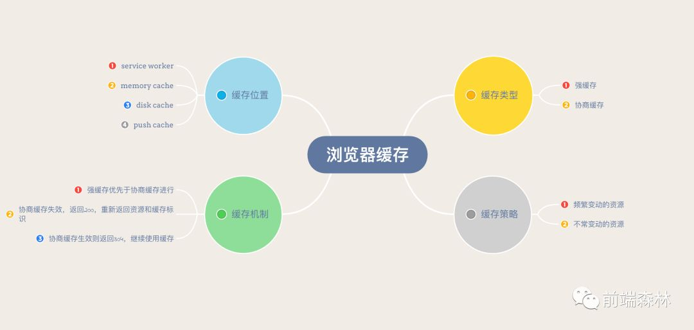
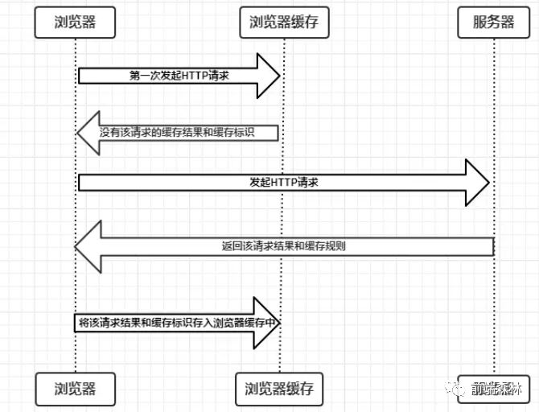
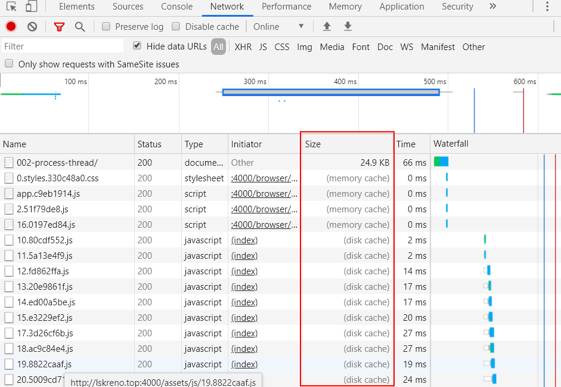
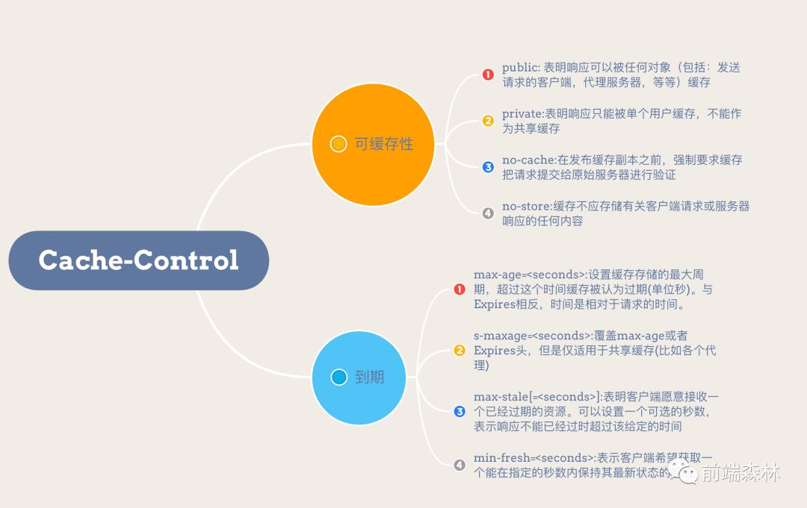
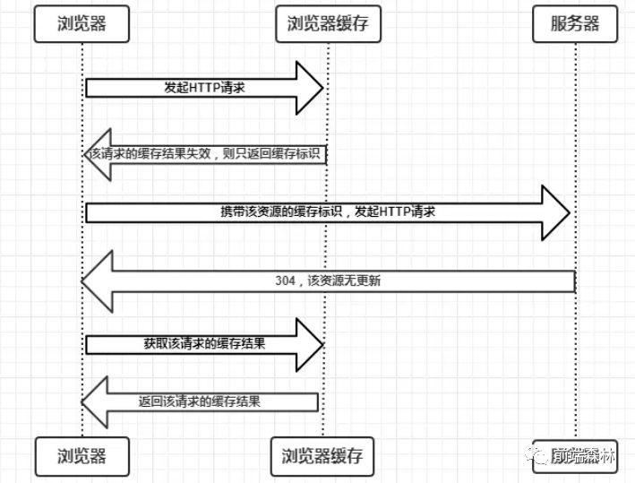
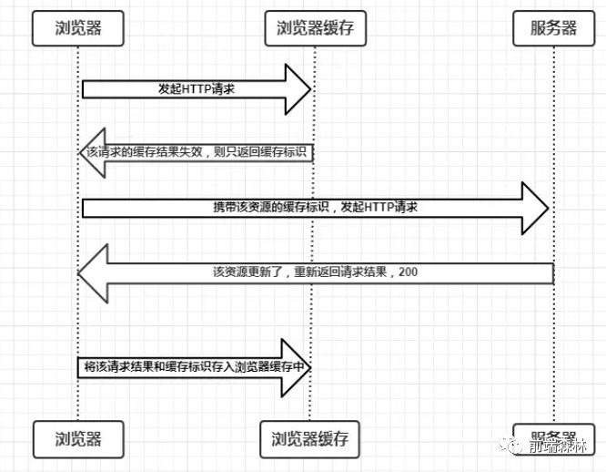
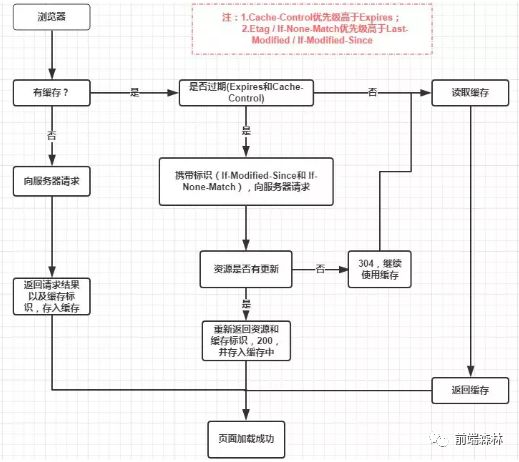

# 001-浏览器的缓存机制

<motto></motto>

我们的梦想是什么？优化！我们的梦想是什么？优化！我们的梦想是什么？优化！

性能优化中，缓存是最重要，最直接，最有效的。

一个优秀的缓存策略可以缩短网页请求资源的距离，减少延迟，并且由于缓存文件可以重复利用，还可以减少带宽，降低网络负荷。

## 一、缓存位置

从缓存位置上来说分为四种，并且各自有优先级，当依次查找缓存且都没有命中的时候，才会去请求网络。

* Service Worker
* Memory Cache
* Disk Cache
* Push Cache

### 1. Service Worker

Service Worker 是运行在浏览器背后的独立线程，一般可以用来实现缓存功能。使用 Service Worker 的话，传输协议必须为 HTTPS。因为 Service Worker 中涉及到请求拦截，所以必须使用 HTTPS 协议来保障安全。

除了`离线缓存`，Service Worker还可以做`消息推送`和`网络代理`等功能。

### 2. Memory Cache

Memory Cache 也就是内存中的缓存，主要包含的是当前页面中已经抓取到的资源，例如页面上已经下载的样式、脚本、图片等。读取内存中的数据肯定比磁盘快，内存缓存虽然读取高效，可是缓存持续性很短，会随着渲染进程的释放而释放（当渲染进程结束后，内存缓存也就不存在了。也就是说一旦我们关闭 Tab 页面，内存中的缓存也就被释放了）。

内存缓存中有一块重要的缓存资源是 preloader 相关指令（例如 `<link rel="prefetch">` ）众所周知 preloader 的相关指令已经是页面优化的常见手段之一，它可以一边解析 js/css 文件，一边网络请求下一个资源。

### 3. Disk Cache

Disk Cache 也就是存储在硬盘中的缓存，读取速度虽然慢点，但是什么都能存储到磁盘中，与 Memory Cache 相比，优势是容量和存储时效性。

在所有浏览器缓存中，Disk Cache 覆盖面基本上是最大的。它会根据 HTTP Header 中的字段判断哪些资源缓存（不用慌，关于 HTTP 的协议头中的缓存字段，会在下面详细介绍的），哪些资源可以不请求直接使用，哪些资源已经过期需要重新请求。并且即使在跨站点的情况下，相同地址的资源一旦被硬盘缓存下来，就不会再次去请求数据。绝大部分的缓存都来自 Disk Cache。

> 浏览器会把哪些文件丢进内存中？哪些丢进硬盘中？

关于这点，网上说法不一，不过以下两点比较靠得住：

* 对于大文件来说，大概率是不存储在内存中的
* 当前系统内存使用率高的话，文件优先存进硬盘

### 4. Push Cache

Push Cache（推送缓存）是 HTTP/2 中的内容，当以上三种缓存都没有命中时，它才会被使用。它只在会话（Session）中存在，一旦会话结束就被释放，并且缓存时间也很短暂。

如果以上四种缓存都没有命中的话，那么只能发起请求来获取资源了。

> 为了性能上的考虑，大部分的接口都应该选择好缓存策略，通常浏览器缓存策略分为两种：
>
> `强缓存` 和 `协商缓存` , 
>
> 并且缓存策略都是通过设置 `HTTP Header` 来实现的。

## 二、缓存过程分析

浏览器与服务器通信的方式为 `应答模式` ，即：浏览器发起 HTTP 请求 >> 服务器响应该请求

那么浏览器怎么确定一个资源该不该缓存，如何去缓存呢？

浏览器第一次向服务器发起该请求后拿到请求结果后，将 `请求结果` 和 `缓存标识` 存入浏览器缓存，浏览器对于缓存的处理是根据第一次请求资源时返回的响应头来确定的。具体过程如下图：

由上图我们可以知道：

* 浏览器每次发起请求，都会先在浏览器缓存中查找该请求的结果以及缓存标识。
* 浏览器每次拿到返回的请求结果都会将该结果和缓存标识存入浏览器缓存中。

以上两点是浏览器缓存机制的关键，它确保了每个请求的缓存存入与读取。下面说一下浏览器缓存的使用规则。根据是否需要向服务器重新发起 HTTP 请求将缓存过程分为两个部分，分别是强缓存和协商缓存。

### 1. 强缓存

强缓存：不会向服务器发起请求，直接从缓存中读取资源，在 chrome 控制台的 Network 选项中可以看到该请求返回 200 的状态码，并且 `size显示from disk cache` 或 `from memory cache` 。

强缓存可以通过设置两种 HTTP Header 实现： `Expires ` 和 `Cache-Control` 。

#### 1. Expires

缓存过期时间，用来指定资源到期的时间，是服务端的具体时间点。也就是说，Expires=max-age + 请求时间，需要和 Last-modified 结合使用。

Expires 是 Web 服务器响应消息头字段，在响应 http 请求时告诉浏览器在过期时间前浏览器可以直接从浏览器缓存取数据，而无需再次请求。

Expires 是 `HTTP/1` 的产物，受限于本地时间，如果修改了本地时间，可能会造成缓存失效。也就是说如果**服务器的时间和浏览器的时间并不一致**，那服务器返回的这个过期时间就是不准确的。因此这种方式很快在后来的HTTP1.1版本中被抛弃了。

`Expires` 响应头包含日期/时间， 即在此时候之后，响应过期。

无效的日期，比如 0, 代表着过去的日期，即该资源已经过期。

如果在[`Cache-Control`](https://developer.mozilla.org/zh-CN/docs/Web/HTTP/Headers/Cache-Control)响应头设置了 "max-age" 或者 "s-max-age" 指令，那么 `Expires` 头会被忽略。

#### 2. Cache-Control

在 HTTP/1.1 中， `Cache-Control ` 是最重要的规则，主要用于控制网页缓存。

`Cache-Control` 可以在请求头或者响应头中设置，并且可以组合使用多种指令：

- `no-store` : 禁止进行缓存，缓存中不得存储任何关于客户端请求和服务端响应的内容。每次由客户端发起的请求都会下载完整的响应内容。
- `no-cache` : 需要进行协商缓存，强制要求发送请求到服务器确认是否使用缓存，此方式下，每次有请求发出时，会将此请求发到服务器（该请求应该会带有与本地缓存相关的验证字段），服务器端会验证请求中所描述的缓存是否过期，若未过期（实际就是返回304），则缓存才使用本地缓存副本。
- `public` : 表示该响应可以被任何中间人（比如中间代理、CDN等）缓存。若指定了`public`，即使是通常不被缓存的内容（因为默认是private），例如，该响应**没有max-age指令或Expires消息头**，再比如 **带有HTTP验证信息（帐号密码）的页面** 或 **某些特定状态码的页面**，将会被其缓存。
- `private` : 表示该响应是专用于某单个用户的，中间人不能缓存此响应，该响应只能应用于浏览器私有缓存中。
- `max-age` : 表示资源能够被缓存（保持新鲜）的最大时间。相对[Expires](https://developer.mozilla.org/zh-CN/docs/Web/HTTP/Headers/Expires)而言，**max-age是距离请求发起的时间的秒数**。针对应用中那些不会改变的文件，通常可以手动设置一定的时长以保证缓存有效，例如图片、css、js等静态资源。
- `s-maxage` : 覆盖max-age或者Expires头，但是仅适用于共享缓存(比如各个代理)，私有缓存会忽略它。

* `max-stale` : 表明客户端愿意接收一个已经过期的资源。可以设置一个可选的秒数，表示响应不能已经过时超过该给定的时间。
* `min-fresh` : 表示客户端希望获取一个能在指定的秒数内保持其最新状态的响应。
* `must-revalidate` : 是缓存就会有过期的时候，加上这个字段一旦缓存过期，就必须回到源服务器验证。

#### 3. Expires 和 Cache-Control 两者对比

其实这两者差别不大，区别就在于 Expires 是 http1.0 的产物，Cache-Control 是 http1.1 的产物，**两者同时存在的话，Cache-Control 优先级高于 Expires**；在某些不支持 HTTP1.1 的环境下，Expires 就会发挥用处。所以 Expires 其实是过时的产物，现阶段它的存在只是一种兼容性的写法。

强缓存判断是否缓存的依据来自于**是否超出某个时间或者某个时间段**，而**不关心服务器端文件是否已经更新**，这可能会导致加载文件不是服务器端最新的内容。

那我们如何获知服务器端内容是否已经发生了更新呢？此时我们需要用到协商缓存策略。

### 2. 协商缓存

协商缓存就是强制缓存失效后，浏览器携带缓存标识向服务器发起请求，由服务器根据缓存标识决定是否使用缓存的过程，主要有以下两种情况：

* 协商缓存生效，返回 `304` 和 `Not Modified` ，告诉浏览器资源没有改动，可使用本地的缓存，继续刷新缓存新鲜度。

* 缓存失效，返回 `200` 和 `请求结果` 

协商缓存可以通过设置两种 HTTP Header 实现： `Last-Modified` 和 `ETag` 

#### 1. Last-Modified

即最后修改时间。在浏览器第一次给服务器发送请求后，服务器会在响应头中加上这个字段。

浏览器接收到后，如果再次请求，会在请求头中携带 `If-Modified-Since` 字段，这个字段的值也就是服务器传来的最后修改时间。

服务器拿到请求头中的 `If-Modified-Since` 的字段后，其实会和这个服务器中 `该资源的最后修改时间` 对比:

* 如果请求头中的这个值**小于**最后修改时间，说明是时候更新了。返回新的资源，跟常规的HTTP请求响应的流程一样。
* 否则返回304，告诉浏览器直接用缓存。

#### 2. ETag

`ETag` 是服务器根据当前文件的内容，给文件生成的唯一标识，只要里面的内容有改动，这个值就会变。服务器通过 `响应头` 把这个值给浏览器。

浏览器接收到 `ETag` 的值，会在下次请求时，将这个值作为**If-None-Match**这个字段的内容，并放到请求头中，然后发给服务器。

服务器接收到**If-None-Match**后，会跟服务器上该资源的**ETag**进行比对:

* 如果两者不一样，说明要更新了。返回新的资源，跟常规的HTTP请求响应的流程一样。
* 否则返回304，告诉浏览器直接用缓存。

#### 3. Last-Modified 和 ETag两者对比

1. 在 `精准度` 上， `ETag` 优于 `Last-Modified` 。优于 ETag 是按照内容给资源上标识，因此能准确感知资源的变化。而 Last-Modified 就不一样了，它在一些特殊的情况并不能准确感知资源变化，主要有两种情况:

* 编辑了资源文件，但是文件内容并没有更改，这样也会造成缓存失效。
* Last-Modified 能够感知的单位时间是秒，如果文件在 1 秒内改变了多次，那么这时候的 Last-Modified 并没有体现出修改了。

1. 在性能上， `Last-Modified` 优于 `ETag` ，也很简单理解， `Last-Modified` 仅仅只是记录一个时间点，而 `Etag` 需要根据文件的具体内容生成哈希值。

另外，如果两种方式都支持的话，服务器会优先考虑 `ETag` 。

## 三、缓存机制

强制缓存优先于协商缓存进行。

若强制缓存 (Expires 和 Cache-Control) 生效则直接使用缓存，若不生效则进行协商缓存 (Last-Modified / If-Modified-Since 和 Etag / If-None-Match)，协商缓存由服务器决定是否使用缓存，若协商缓存失效，那么代表该请求的缓存失效，返回 200，重新返回资源和缓存标识，再存入浏览器缓存中；生效则返回 304，继续使用缓存。具体流程图如下：

## 四、缓存过期后如何处理

初学浏览器缓存尤其是看到过期时间时，一定会有关于缓存过期后如何处理的疑惑：

- 到底是过期时间一到就直接删掉（但学了协商缓存后，发现应该不是直接删掉的）？
- 还是等一段时间再删，那这个时间是多少呢？这个删除算法到底是怎么回事？

理论上来讲，当一个资源被缓存存储后，该资源应该可以被永久存储在缓存中。

由于缓存只有有限的空间用于存储资源副本，所以缓存会定期地将一些副本删除，这个过程叫做`缓存驱逐`。

另一方面，当服务器上面的资源进行了更新，那么缓存中的对应资源也应该被更新，由于HTTP是C/S模式的协议，服务器更新一个资源时，不可能直接通知客户端更新缓存，所以双方必须为该资源约定一个过期时间，在该过期时间之前，该资源（缓存副本）就是新鲜的，当过了过期时间后，该资源（缓存副本）则变为陈旧的*。*

驱逐算法用于将陈旧的资源（缓存副本）替换为新鲜的。

注意，***一个陈旧的资源（缓存副本）是不会直接被清除或忽略的***.

当客户端发起一个请求时，缓存检索到已有一个对应的陈旧资源（缓存副本），则缓存会先将此请求附加一个`If-None-Match`头，然后发给目标服务器，以此来检查该资源副本是否是依然还是算新鲜的，若服务器返回了 [`304`](https://developer.mozilla.org/en-US/docs/Web/HTTP/Status/304) (Not Modified)（该响应不会有带有实体信息），则表示此资源副本是新鲜的，这样一来，可以节省一些带宽。

若服务器通过 `If-None-Match` 或`If-Modified-Since`判断后发现已过期，那么会带有该资源的实体内容返回。

## 五、实际场景应用缓存策略

- 频繁变动的资源

对于频繁变动的资源，首先需要使用 Cache-Control: no-cache 使浏览器每次都请求服务器，然后配合 ETag 或者 Last-Modified 来验证资源是否有效。这样的做法虽然不能节省请求数量，但是能显著减少响应数据大小。

- 不常变化的资源

通常在处理这类资源时，给它们的 Cache-Control 配置一个很大的 max-age=31536000 (一年)，这样浏览器之后请求相同的 URL 会命中强制缓存。而**为了解决更新的问题，就需要在文件名 (或者路径) 中添加 hash， 版本号等动态字符**，之后更改动态字符，从而达到更改引用 URL 的目的，让之前的强制缓存失效 (其实并未立即失效，只是不再使用了而已)。

## 六、用户行为对浏览器缓存的影响

所谓用户行为对浏览器缓存的影响，指的就是用户在浏览器如何操作时，会触发怎样的缓存策略。主要有 3 种：

- 打开网页，地址栏输入地址：查找 disk cache 中是否有匹配。如有则使用；如没有则发送网络请求；
- 普通刷新 (F5)：因为 TAB 并没有关闭，因此 memory cache 是可用的，会被优先使用 (如果匹配的话)。其次才是 disk cache；
- 强制刷新 (Ctrl + F5)：浏览器不使用缓存，因此发送的请求头部均带有 Cache-control: no-cache(为了兼容，还带了 Pragma: no-cache), 服务器直接返回 200 和最新内容。

## 七、更多

- [MDN-WebDocs-HTTP缓存](https://developer.mozilla.org/zh-CN/docs/Web/HTTP/Caching_FAQ)