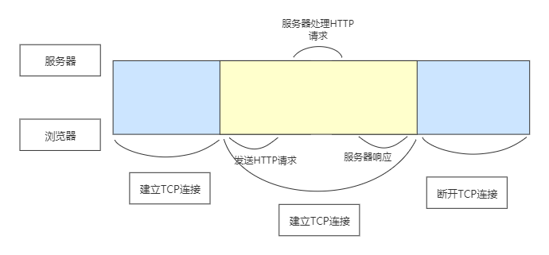

# 003-从输入URL到页面加载显示完成到底发生了什么？——网络篇

<motto></motto>


这个题瞅着挺眼熟，看来不深入了解一下是不行了。
那我们就来看看怎么给面试官一个看起来还行的答案。

**精简版**

如果，你想混一下，那么给你`精简版`：

1. 首先，浏览器根据请求的URL交给DNS域名解析，找到真实的IP，向服务器发起请求；

2. 服务器交给后台处理，在完成后返回数据，浏览器就可以接收HTML、CSS、JavaScript等文件；

3. 浏览器对加载到的HTML、CSS、JavaScript等资源进行语法解析，构建相应的内部数据结构（DOM树、CSS树、render树等）；
载入解析到的资源文件、渲染页面、完成。

**正式版**
## 一. 处理请求
首先，浏览器会开启一个线程来处理这个请求，浏览器将会分析你输入的内容（`协议头`、`主机域名`或`IP地址`、`端口号`、`请求路径`、`查询参数`、）。

```html
//通用的URL由9部分组成
<scheme>://<user>:<password>@<host>:<port>/<path>;<params>?<query>#<hash>
<scheme>://<host>.<domain>:<port>/<path>/<filename>
```
部分名词解释：
```html
<scheme>：对于web页面来说最常用的协议就是http和https
<user>:<password>：user和password现在不常见，不会在URL明文书写用户名和密码了，都是通过登录的方式
//或者
<host>：定义域主机 。（如http默认的主机是www）
<domain> ： 定义因特网域名。（如http://baidu.com)
<port>：定义主机上的端口号。端口号用来区分主机上的进程，方便找到web服务器，http默认是80
<path>：path是资源的路径，也就是存放位置，不一定和物理路径完全对应，符合web服务器路由约定即可
<params>：在一些协议中需要参数来访问资源，例如 ftp 是二进制还是文本传输，参数是名值对，用;隔开
<query>：这个是get请求最常用的传递参数方式了 ?a=1&b=2&=3
<hash>：hash也称为片段，设计为标识文档的一部分，很多MVVM框架用作了路由功能
//或者
<filename>: 定义文档和资源的名称
```
通常，如果输入的内容里包含了“.com”，浏览器不会认为你输入的是一个搜索关键字。在确定它是一个 URL 之后，浏览器会检查它是否指明了某种协议，如果没有，就会在开头添加“http://”。因为如果你没有指定具体的 HTTP 协议选项，浏览器就会使用默认值，如端口 80、GET 方法、不使用基本的身份验证。

## 二. 构建请求
解析完后，然后开启网络线程，浏览器会构建请求行：
```js
// 请求方法是GET，路径为根路径，HTTP协议版本为1.1
GET / HTTP/1.1
```

## 三. 查找强缓存
在真正发起网络请求之前，浏览器会先在浏览器缓存中查询是否有要请求的文件。

其中，浏览器缓存是一种在本地保存资源副本，以供下次请求时直接使用的技术。当浏览器发现请求的资源已经在浏览器缓存中存有副本，它会拦截请求，返回该资源的副本，并直接结束请求，而不会再去源服务器重新下载。

这样做的好处有：

- 缓解服务器端压力，提升性能（获取资源的耗时更短了）；

- 对于网站来说，缓存是实现快速资源加载的重要组成部分。

当然，如果缓存查找失败，就会进入下一步。

## 四. DNS解析
HTTP 网络请求的第一步是做什么呢？



结合上图看，是和服务器建立 TCP 连接。

那我们凭借什么信息来建立连接呢？

建立 TCP 连接的第一步就是需要准备 IP 地址和端口号。

那怎么获取 IP 地址和端口号呢？

我们发现，我们只有一个 URL 地址，那么是否可以**利用 URL 地址来获取 IP 和端口信息**呢？

一般我们输入的URL是服务器域名，数据包是通过`IP地址`传给对方的，那我们就需要知道对方的`IP地址`，这个过程需要依赖一个服务系统，这个系统将域名和 IP 一一映射，我们将这个系统就叫做DNS（Domain Name System域名系统）。得到具体 IP 的过程就是DNS解析。（DNS就像是一个翻译）；

**解析过程**

DNS解析是一个递归查询的过程。

上述图片是查找www.google.com的IP地址过程。

首先在`本地域名服务器`中查询IP地址，如果没有找到的情况下，`本地域名服务器`会向`根域名服务器`发送一个请求，如果`根域名服务器`也不存在该域名时，本地域名会向`com顶级域名服务器`发送一个请求，依次类推下去。直到最后`本地域名服务器`得到google的IP地址并把它缓存到本地，供下次查询使用。

从上述过程中，可以看出网址的解析是一个从右向左的过程: com -> google.com -> www.google.com。但是你是否发现少了点什么，`根域名服务器`的解析过程呢？事实上，真正的网址是www.google.com.，并不是我多打了一个.，这个.对应的就是`根域名服务器`，默认情况下所有的网址的最后一位都是.，既然是默认情况下，为了方便用户，通常都会省略，浏览器在请求DNS的时候会自动加上，所有网址真正的解析过程为: . -> .com -> google.com. -> www.google.com.。

**DNS优化**

上文中请求到google的IP地址时，经历了8个步骤，这个过程中存在多个请求(同时存在UDP和TCP请求,DNS在区域传输的时候使用TCP协议，其他时候使用UDP协议。)。

试想如果每次都经过这么多步骤，那就太耗时间？如何减少该过程的步骤呢？那就是DNS缓存。

**DNS缓存**

DNS存在着多级缓存，从离浏览器的距离排序的话，有以下几种: 
- 浏览器缓存（注意： 浏览器的缓存一般不会太长，1min左右。假如时间设置过长，会导致DNS在IP变更时不能及时解析获取到最新的IP）
- 系统缓存（如果是第一次访问网站，将会查找系统缓存。）
- 路由器缓存
- ISP服务器缓存(Internet Service Provider的简称，即因特网服务提供商,咱们一般就是网通或者电信。这时就会到电信（你的服务商）的DNS 上查找缓存)

**如果以上都没有，开启`递归搜索`查找IP的过程**

- 根域名服务器缓存
- 顶级域名服务器缓存
- 主域名服务器缓存


**所以，重点来啦，在DNS解析的时候，**

1. 浏览器会先搜索自己的 DNS 缓存（维护一张域名与 IP 地址的对应表）；

2. 搜索操作系统中的 DNS 缓存（维护一张域名与 IP 地址的对应表）；

3. 搜索操作系统的 hosts 文件（ Windows 环境下，维护一张域名与 IP 地址的对应表）；

4. 操作系统将域名发送至 LDNS（本地区域名服务器，如果你在学校接入互联网，则 LDNS 服务器就在学校，如果通过电信接入互联网，则 LDNS 服务器就在你当地的电信那里。）LDNS 查询自己的 DNS 缓存（一般查找成功率在 80% 左右），查找成功则返回结果，失败则发起一个迭代 DNS 解析请求；

5. LDNS 向 Root Name Server （根域名服务器，其虽然没有每个域名的的具体信息，但存储了负责每个域，如 com、net、org等的解析的顶级域名服务器的地址）发起请求，此处，Root Name Server 返回 com 域的顶级域名服务器的地址；

6. LDNS 向 com 域的顶级域名服务器发起请求，返回 google.com 域名服务器地址；

7. LDNS 向 google.com 域名服务器发起请求，得到 www.google.com 的 IP 地址；

8. LDNS 将得到的 IP 地址返回给操作系统，同时自己也将 IP 地址缓存起来；

9. 操作系统将 IP 地址返回给浏览器，同时自己也将 IP 地址缓存起来；

那么现在，浏览器已经得到了域名对应的 IP 地址。

**DNS负载均衡**

不知道大家有没有思考过一个问题: DNS返回的IP地址是否每次都一样？

如果每次都一样是否说明你请求的资源都位于同一台机器上面，那么这台机器需要多高的性能和储存才能满足亿万请求呢？其实真实的互联网世界背后存在成千上百台服务器，大型的网站甚至更多。

但是在用户的眼中，它需要的只是处理他的请求，哪台机器处理请求并不重要。

DNS可以返回一个合适的机器的IP给用户，例如可以根据每台机器的负载量，该机器离用户地理位置的距离等等，这种过程就是`DNS负载均衡`，又叫做`DNS重定向`。

大家耳熟能详的`CDN(Content Delivery Network)`就是利用DNS的重定向技术，DNS服务器会返回一个跟用户最接近的点的IP地址给用户，CDN节点的服务器负责响应用户的请求，提供所需的内容。

## 五. 等待 TCP 队列

通过DNS拿到 IP 之后，接下来就需要获取端口号了。通常情况下，如果 URL 没有特别指明端口号，那么 HTTP 协议默认是 80 端口。

Chrome 有个机制，同一个域名同时最多只能建立 6 个 TCP 连接，如果在同一个域名下同时有 10 个请求发生，那么其中 4 个请求会进入排队等待状态，直至进行中的请求完成。当然，如果当前请求数量少于 6，会直接进入下一步，建立 TCP 连接。

所以，本步可能不存在。


## 六. 建立TCP连接+进行HTTP请求
> HTTP 请求分为三个部分：TCP 三次握手、HTTP请求、响应信息、关闭 TCP 连接

### TCP
那么TCP是什么呢？

> TCP（Transmission Control Protocol，传输控制协议）是一种面向连接的、可靠的、基于字节流的传输层通信协议。

TCP的可靠主要体现在以下三个方面：

- 三次握手确认连接：TCP的三次握手主要是为了确认双方（即客户端和服务端）都拥有接收和发送数据的能力，通过发送3个数据包来建立客户端和服务器之间的连接。

- 数据包校验，保证数据到达接收方：就是接收方接收到数据包后必须要向发送方确认, 如果发送方没有接到这个确认的消息，就判定为数据包丢失，并重新发送该数据包。当然，发送的过程中还有一个优化策略，就是把大的数据包拆成一个个小包，依次传输到接收方，接收方按照这个小包的顺序把它们组装成完整数据包。

- 通过四次挥手断开连接：数据传输完成，现在要断开连接了，通过四次挥手来断开连接。

具体TCP的相关知识，可查看[搞懂那个TCP](/network-tcp/001/)

### 发送HTTP请求
HTTP的请求报文由`请求行（request line）`、`请求头（header）`、`请求体`三个部分组成。

**请求行**
```js
// 格式：Method Request-URL HTTP-Version CRLF(换行符)
// 请求方法是GET，路径为根路径，HTTP协议版本为1.1
GET / HTTP/1.1
```
请求行，包含`请求方法`、`URL`、`协议版本`

常用的请求方法：GET, POST, PUT, DELETE, OPTIONS, HEAD

URL 即请求地址

现在常用的协议版本为 HTTP/1.1

**请求头**

请求头，包含请求的附加信息，由 关键字/值 对组成，每行一对，用英文冒号分隔。

```http
Accept: text/html,application/xhtml+xml,application/xml;q=0.9,image/webp,image/apng,*/*;q=0.8,application/signed-exchange;v=b3
Accept-Encoding: gzip, deflate, br
Accept-Language: zh-CN,zh;q=0.9
Cache-Control: no-cache
Connection: keep-alive
Cookie: /* 省略cookie信息 */
Host: www.google.com
Pragma: no-cache
Upgrade-Insecure-Requests: 1
User-Agent: Mozilla/5.0 (Windows NT 10.0; Win64; x64) AppleWebKit/537.36 (KHTML, like Gecko) Chrome/80.0.3987.132 Safari/537.36
```
说几个主要的，

Host: 表示主机名，虚拟主机；

Connection: HTTP/1.1 增加的，使用 keepalive，即持久连接，一个连接可以发多个请求；

User-Agent: 请求发出者；

**请求体(请求正文)**

请求体在GET方法时不存在，在POST，PUT等方法下存在，常见的场景是表单提交

GET产生一个TCP数据包，POST产生两个

GET请求时会把headers和data数据一起发送出去；

POST请求时，浏览器先发送headers，服务器100继续，浏览器再发送data。


## 七.数据的传输过程
### 传输层
寻得服务器地址，客户端在`传输层`便可以和服务器通过三次握手建立tcpip连接
### 网络层
在上边DNS解析的过程中我们已经拿到了IP地址，此时`网络层`便会通过IP地址寻得对应服务器的物理地址
### 数据链路层
连接建立后`数据链路层`将数据包装成帧；
### 物理层
最后`物理层`利用物理介质进行传输；

到了服务器，就会通过相反的方式将数据一层一层的还原回去；

## 八.响应报文
HTTP响应报文也是由三部分组成: `响应行`, `响应报头`和`响应报文`。

**响应行**
```js
// 格式：HTTP-Version Status-Code Status-Code-Description CRLF(换行符)
// HTTP协议版本为1.1 状态码是200，状态描述为OK，
HTTP/1.1 200 OK
```
我们可以看到响应行由`HTTP协议版本`、`状态码`和`状态描述`组成。

状态码是由3位数组成，第一个数字定义了响应的类别，且有五种可能取值:
- 1xx：指示信息–表示请求已接收，继续处理。
- 2xx：成功–表示请求已被成功接收、理解、接受。
- 3xx：重定向–要完成请求必须进行更进一步的操作。
- 4xx：客户端错误–请求有语法错误或请求无法实现。
- 5xx：服务器端错误–服务器未能实现合法的请求。

平时遇到比较常见的状态码有:200, 204, 301, 302, 304, 400, 401, 403, 404, 422, 500。

**响应报头**

响应头部包含 `响应报文的附加信息`，由 属性/值 对组成

**响应体(响应报文)**

响应主体包含 `回车符`、`换行符`和 `响应返回数据`，但并不是所有响应报文都有响应数据

## 九.总结
处理请求->构建请求->查找强缓存->DNS解析->建立TCP连接->进行HTTP请求->得到HTTP响应

