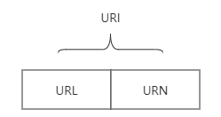

# 基本知识点汇总

<motto></motto>

知识点列表：

* URL
* DNS解析、IP地址
* 浏览器缓存
* TCP建立连接
* 服务器处理、HTTP请求（HTTP缓存，产生 HTTP报文，请求报文、响应报文）
* 状态码
* 网站处理、MVC后台、数据库请求
* 浏览器渲染（浏览器渲染引起的问题Repaint 和 Reflow、script放置问题+页面加载产生的白屏和FOUC、CSS加载造成阻塞问题）
* TCP连接结束
* 性能优化

现象：用户体验、网页太卡打不开（卡、慢）、服务器带宽流量（成本）、服务器压力
从哪处理：JS加载顺序、浏览器加载-白屏和FOUC、CSS阻塞、函数节流+防抖、减少HTTP请求+HTPP缓存机制、使用CDN

## 1. URL

### 1、URL/URI 分别是什么
当我们在浏览器里输入 `www.google.com` 之后，我们会看到谷歌的官网。

那么这个地址有什么规定吗？还是说我们怎么输入都可以进入一个网站？AAA. BBB. CCC 也可以吗？

当然不是的，我们所输入的地址格式必须要满足 URI 的规范。

`URI` 的全称是（Uniform Resource Identifier），中文名称是 `统一资源标识符` ，使用它就能够唯一地标记互联网资源（如图片、文件或html, css, js文件等。）

`URL` 的全称是（Uniform Resource Locator），中文名称是 `统一资源定位符` ，也就是我们俗称的 `网址` ，它实际上是 URI 的一个子集。

URI 不仅包括 URL，还包括 URN（统一资源名称），它们之间的关系如下：

## 2. 计算机网络

### （1）五层因特尔协议栈：

* 应用层（dns、http）：DNS解析成IP并完成http请求发送；
* 传输层（tcp、udp）：三次握手四次挥手模式建立tcp连接；
* 网络层（IP、ARP）：IP寻址；
* 数据链路层（PPP）：将请求数据封装成帧；
* 物理层：利用物理介质传输比特流（传输的时候通过双绞线、电磁波等）
* OIS七层框架: 多了两层即，会话层（处理两个通信系统中交换信息的表示方式）和表示层（管理不同用户和进程之间的对话）。

### （2）get和post的区别：

get产生一个tcp数据包，post产生两个

get请求时会把headers和data数据一起发送出去；

post请求时，浏览器先发送headers，服务器100继续，浏览器再发送data。

### （3）DNS查询得到IP

1. 请求信息：首先查看域名的本地DNS缓存，该缓存存储计算机最近检索到的信息，如果计算机不知道答案，那么就需要执行一个DNS查询来查找答案；
2. 询问递归式DNS服务器：
  + 如果信息不存储在本地，计算机会联系您的ISP（网络提供商）的递归DNS服务器；
  + 这些专用计算机会为你执行一个DNS查询工作；
  + 递归服务器有自己的缓存，所以这个查询过程通常在这里完成，并将信息还回给用户；
3. 询问根域名服务器
  + 如果递归服务器没有答案，他们会查询根域名服务器；
  + 根域名服务器是一种计算机，它扮演着一种DNS的电话接线员的角色，他们不知道答案，但可以将我们的疑问指向知道在哪里可以找到答案的人。
4. 询问TLD顶级域名服务器（Top-level domain server）：
  + 根域名服务器将查看请求的第一部分，按从右到左的顺序，从www.google.com中找到.com，并将请求指向.com对应的顶级域名服务器（TLD）.com;
  + 每个TLD，如（.com, .org, .us）都有自己的顶级域名服务器，
  + 这些服务器没有我们需要的信息，但他们可以直接将我们引导到有信息的服务器。
5. 询问权威的DNS服务器
  + TLD域名服务器会继续检查请求的下一部分（google）www.google.com，并将查询指向负责此特定域名的服务器；
  + 这些权威的服务器将负责了解关于特定域的所有信息，并将信息存储在DNS记录。
6. 找回记录：
  + 递归服务器从权威服务器中检索google.com的记录，并将记录存储在本地缓存；
    - 如果其他任何人请求google.com的主机记录，递归服务器已经有答案了，并不需要再次进行查找；
    - 所有记录都有一个期限，一段时间后，递归服务器将需要要求一个新的记录副本，以确保信息不回过时。
7. 接收答案：
  + 有了答案，递归服务器将记录返回到计算机，
  + 您的计算机将记录存储在缓存中，从记录中读取IP地址，然后将这些信息传递给浏览器；
  + 然后浏览器就可以根据IP地址和服务器进行连接建立。

### （4）TCPIP请求

http的本质就是TCPIP请求；

需要经历3次握手建立连接，4次挥手断开连接；

TCP将http长报文划分为短报文，通过三次握手与服务器端建立连接，进行可靠传输。

#### TCP/IP的并发限制：

浏览器对同一个域名下并发的TCP连接是有限制的（2-10个不等）

Chrome 在同一个域名下要求同时最多只能有 6 个 TCP 连接，超过 6 个的话剩下的请求就得等待。

而且在http1.0中往往一个资源的下载就需要一个tcp/ip请求

## 3. 浏览器机制

### （1）进程和线程的概念

进程是CPU资源分配的最小单位，是能拥有资源和独立运行的最小单位；

线程是CPU调度的最小单位，线程是建立在进程的基础上的一次程序运行单位，一个进程可以拥有多个线程；

通俗的讲：进程是一个工厂，工厂有它独立的资源，工厂之间相互独立->进程之间相互独立，线程是工厂中的工人，多个工人之间可以协作完成任务，工厂内有一个或多个工人，工人之间共享空间。

### （2）多进程的浏览器

浏览器是多进程的，有一个主控进程，以及每一个tab页面都会开一个进程（某些情况下多个tab由于优化策略会合并）

#### 浏览器主要进程：

1. Browser进程：浏览器的主进程，负责协调、主控，只有一个，作用：
  + 负责浏览器界面的显示、与用户交互（如前进、后退等）
  + 负责各个页面的管理，创建和销毁其他进程；
  + 将Renderer进程得到的内存中的Bitmap绘制到用户界面上
  + 网络资源的管理和下载等
2. 第三方插件进程： 每种类型的插件对应一个进程，仅当该插件使用时才创建；
3. GPU进程： 最多一个，用于3D绘制等；
4. 浏览器渲染进程（Renderer进程、浏览器内核、内部是多线程）：
  + 默认没打开一个tab页面，就会启动一个Renderer进程；
  + 负责页面的渲染，脚本的执行，事件的处理。

#### 浏览器多进程的优势

* 避免单个page crash影响整个浏览器；
* 避免第三方插件crash影响整个浏览器
* 多进程充分利用多核优势；
* 方便使用沙盒模型隔离插件等进程，提高浏览器稳定性

> 简单点理解：如果浏览器是单进程，那么某个tab页或第三方插件崩溃了，就会导致整个浏览器崩溃，体验度极差，不过多进程内存消耗会更大，有点用空间换时间。

## 4. 浏览器内核（渲染进程）

浏览器渲染进程内部是多线程，包含主要线程有：

### 1. GUI渲染线程：

* （1）负责浏览器界面的渲染，解析HTML、CSS，构建DOM树和RenderObject树，布局和绘制等；
* （2）当界面需要重绘（Repaint）或由于某种操作引发回流（reflow）时该线程会执行；
* **注意：GUI渲染线程和JS引擎线程是互斥的**，当JS引擎执行时GUI线程会被挂起，GUI更新会保存在一个队列中等JS引擎空闲时立即执行。

### 2. JS引擎线程：

* JS内核，负责处理JavaScript脚本程序（V8引擎）
* 负责解析JavaScript脚本，运行代码；
* JS引擎一直等待着任务队列中的任务到来，然后加以处理，一个tab页面（renderer进程）中无论什么时候都只有一个JS线程在运行JS程序；
* **注意：由于GUI渲染线程和JS引擎线程是互斥的**，所以如果JS程序运行时间过长，这样会导致页面渲染不连贯，导致页面渲染加载阻塞；

### 3. 事件触发线程：

* 归属于浏览器，而不是JS引擎，用来控制事件循环；
* 当JS引擎执行代码块如setTimeOut时（也可以来自浏览器内核的其他线程，如鼠标单击事件、AJAX异步请求等），会将对应的任务添加到事件线程中；
* 当对应的事件符合触发条件被触发时，该线程就会把事件添加到JS的待处理队列的队尾，等待JS引擎的处理；
* **注意：由于JS的单线程**的关系所以这些待处理队列中的事件都得排队等待JS引擎处理（当JS引擎空闲时才会去执行）。

### 4. 定时触发器线程：

* setTimeOut与setInterval所在的线程；
* 浏览器的定时计数器并不是由JavaScript引擎计数的，（因为JavaScript是单线程，如果处于阻塞状态就会影响计时的准确）因此通过单独的线程来- 计时并触发定时（计时完毕后，添加到事件队列，等待JS引擎空闲时执行）

### 5. 异步http请求线程：

* 在XMLHttpRequest在连接后是通过浏览器新开一个线程请求的
* 将检测到状态变更时，如果设置有回调函数，异步线程就将产生状态变更事件，将这个回调在放到事件队列中，再由JavaScript引擎执行。

> HTTPS的话

> 应用层——发起请求的逻辑

> 表示层——HTTP

> 会话层——TLS

> 传输层——TCP

> 网络层——数据包路由（IP）

> 数据链路层——帧（就像是数据包的容器）

> 物理层——比特流

> 在进行 TLS 握手时，在确定协议之后它们会交换证书，这点被我漏掉了。网络方面的知识不是我的强项。

> 本篇基础知识主要来自： [keywords](https://segmentfault.com/a/1190000014872028)

