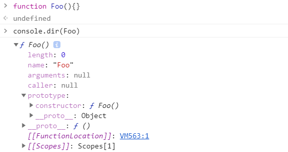
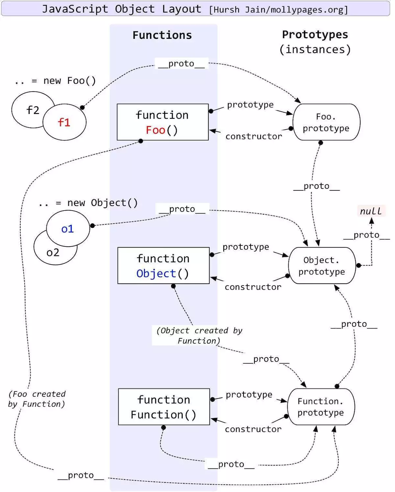

# 002-JavaScript原型和原型链

<motto></motto>

## 一、原型

### 1. 什么是JS的原型

`原型` 就是一个对象，我们也称它为 `原型对象` 。

### 2. 原型长什么样子

那么原型长什么样子呢？

假如现在有一个函数Foo()，那么当你在控制台将它打印出来后，你会发现他有一个prototype属性， `Foo.prototype` 这个就是Foo的原型了。



### 3. 原型的作用（为什有原型对象这个东东/为什么要设计原型对象？）

原型的作用，就是可以 `共享属性、方法` 。
我们通过 `Foo.prototype.method` 可以共享属性、方法。

#### 为什么需要共享属性、方法呢？

我们知道JS的继承和Java不同，因为JS没有类的概念，但是JS数据类型里有对象所以就必须涉及到继承啊。那么就只能new 一个构造函数了。所以构造函数就成为了一个实例对象的原型对象。

但是，这样的设计有一个很大的缺点就是无法共享公共属性、方法。

因为我们知道，每 `new` 一个对象，生成的实例是两个不同的对象。所以共有的属性也不是共享的，如果我们改动一个对象的 type 属性，但是另一个不会改变，因为这个属性没有共享。

假如现在我们创建的Foo函数里面有一个getName()方法，那么，在没有原型的情况下，我们每次使用Foo创建一个实例对象，岂不是每个实例对象里都会拥有这个方法。那么当我有一天想要修改这个方法，那我就要每个实例对象就都修改一遍，因为这个方法没有共享。

所以，需要公共的共享属性、方法。

所以就有了原型(原型对象)。

### 4. 原型给函数带来的无限扩展性

所有的数据类型(除了 `null` 和 `undefined` )都有 `constructor` 构造函数(但 `constructor` 不一定是直接的内部属性，它可以在)，但只有 `函数` 才有 `prototype` 属性。

所以 `null` 和 `undefined` 是特殊的数据类型；函数是特殊的对象。

函数由于具有 `prototype` 属性，使它拥有了无限的扩展性。

### 5. 原型的简单总结

* **任何一个函数都拥有 `prototype` 属性。**
  + ** `prototype` 的值是一个对象，具有 `constructor` 属性。**
    - ** `constructor` 也是一个对象。该 `constructor` 的值为该函数本身。**

## 二、原型链

### 1. 什么是JS的原型链

原型与原型之间层层相套、层层链接所形成的链即为 `原型链` 。

由于 `__proto__` 是任何对象都有的属性，而JS里万物皆对象，所以会形成一条 `__proto__` 连起来的链条，递归访问 `__proto__` 必须最终到头，并且值是null。

当JS引擎查找对象的属性时，先查找对象本身是否存在该属性，如果不存在，会在原型链上查找，但不会查找自身的prototype

### 2. 原型链的唯一终点`Object.prototype.__proto__ === null`

**为了让原型链有终点**，在原型链的最顶端，JavaScript规定了`Object.prototype.__proto__ === null`。

由于Function函数的特殊，**为了让原型链有终点**，避免循环引用。所以JavaScript规定`Function.prototype.__proto__ === Object.prototype`，这样既避免了出现循环引用，又让`__proto__`构成的原型链指向了唯一的终点：`Object.prototype.__proto__ === null`。

## 三、 `prototype` 和 `__proto__` 傻傻搞不清

### 1. `prototype` 和 `__proto__` 的区别

* `prototype` 是函数才有的属性
* `__proto__` 是每个对象都有的属性( `__proto__` 不是一个规范属性，只是部分浏览器实现了此属性)

大多数情况下， `__proto__` 可以理解为**“构造器的原型”**，即：

`__proto__ === constructor.prototype` （通过 `Object.create()` 创建的对象不适用此等式）

### 2. `__proto__` 的指向

`__proto__` 的指向取决于对象创建时使用方式。

#### (1) 字面量的方式

创建： `var a = {}` 

构造器constructor： `a.constructor === Object` 构造器为Object

指向： `a.__proto__ === a.constructor.prototype` 或者 `a.__proto__ === Object.prototype` 

#### (2) 构造器的方式

创建：

`var A = function(){}` 

`var a = new A()` 

构造器constructor： `a.constructor === A` 构造器为A

指向： `a.__proto__===a.constructor.prototype` 或者 `a.__proto__===A.prototype.constructor.prototype` 或者 `a.__proto__ === A.prototype` 

#### (3) Object.create()的方式

创建：

`var a1 = {}` 

`var a2 = Object.create(a1)` 

构造器constructor： `a2.constructor === Object` 构造器为Object

指向： `a2.__proto__ === a1` （ `a2.__proto__不等于a2.constructor.prototype` ）

### 3. `__proto__` 指向的通用规则

1. `对象` 有 `__proto__` 属性， `函数` 有 `prototype` 属性；
2. `对象` 由 `函数` 生成; 
3. 生成 `对象` 时， `对象` 的 `__proto__` 属性指向 `函数` 的 `prototype` 属性(**注意Object.create()的创建方式**)。

### 4. Object函数和Function函数的原型（特殊）

上面提到，函数会有一个 `prototype` 属性。而且除了Object函数和Function函数，其他函数的 `prototype` 是一个类型为 `"object"` 的对象，它有两个属性： `constructor` 和 `__proto__` 。其中 `constructor` 属性指向这个函数自身， `__proto__` 属性指向 `Object.prototype` 。

#### Object函数

但是， `Object.prototype` 不太一样了就。

``` shell
> typeof Object.prototype
"object"
> Object.prototype
{
    constructor: ƒ Object()
    hasOwnProperty: ƒ hasOwnProperty()
    isPrototypeOf: ƒ isPrototypeOf()
    propertyIsEnumerable: ƒ propertyIsEnumerable()
    toLocaleString: ƒ toLocaleString()
    toString: ƒ toString()
    valueOf: ƒ valueOf()
    __defineGetter__: ƒ __defineGetter__()
    __defineSetter__: ƒ __defineSetter__()
    __lookupGetter__: ƒ __lookupGetter__()
    __lookupSetter__: ƒ __lookupSetter__()
    get __proto__: ƒ __proto__()
    set __proto__: ƒ __proto__()
}
```

`Object` 函数的 `prototype` 属性也是一个类型为 `"object"` 的对象，但 `Object.prototype` 多了一大堆方法，这些方法都是JavaScript对象的系统默认方法。
 然后，我们还会发现，Object函数的 `prototype` 属性里没有 `__proto__` 属性，当我们我们试着把它的 `__proto__` 属性打出来看看：

``` shell
> Object.prototype.__proto__
null
```

Object函数特殊情况： `Object.prototype.__proto__ === null` ，这就是JavaScript原型链的终点了。

#### Function函数

``` shell
> typeof Function.prototype
"function"
```

Function函数的 `prototype` 属性是一个 `"function"` 类型的对象，而不像其他函数是类型为 `"object"` 的对象。

那它到底是个什么样的函数呢？

``` shell
> console.dir(Function.prototype)
{ ƒ anonymous()
    arguments: (...)
    caller: (...)
    length: 0
    name: ""
    constructor: ƒ Function()
    apply: ƒ apply()
    bind: ƒ bind()
    call: ƒ call()
    toString: ƒ toString()
    Symbol(Symbol.hasInstance): ƒ [Symbol.hasInstance]()
    get arguments: ƒ ()
    set arguments: ƒ ()
    get caller: ƒ ()
    set caller: ƒ ()
    __proto__: Object
    [[FunctionLocation]]: <unknown>
    [[Scopes]]: Scopes[0]
}
```

现在再来看看 `Function.__proto__` 是个什么样子哒。

``` shell
> Function.prototype.__proto__
{
    constructor: ƒ Object()
    hasOwnProperty: ƒ hasOwnProperty()
    isPrototypeOf: ƒ isPrototypeOf()
    propertyIsEnumerable: ƒ propertyIsEnumerable()
    toLocaleString: ƒ toLocaleString()
    toString: ƒ toString()
    valueOf: ƒ valueOf()
    __defineGetter__: ƒ __defineGetter__()
    __defineSetter__: ƒ __defineSetter__()
    __lookupGetter__: ƒ __lookupGetter__()
    __lookupSetter__: ƒ __lookupSetter__()
    get __proto__: ƒ __proto__()
    set __proto__: ƒ __proto__()
}
```

发现没有，看起来很像是 `Object.prototype` ，让我们来看看：

``` shell
> Function.prototype.__proto__ === Object.prototype
true
```

所以，一个 `"function"` 类型的对象，应该是由Function函数生成的，那它的 `__proto__` 属性应该指向 `Function.prototype` ，也就是 `Function.prototype.__proto__ === Function.prototype` 。和Object函数同样的问题出现了：**循环引用**。

所以JavaScript规定 `Function.prototype.__proto__ === Object.prototype` ，这样**既避免了出现循环引用**，又**让 `__proto__` 构成的原型链指向了唯一的终点**： `Object.prototype.__proto__ === null` 。‘

## 四、检验一下自己叭

现在你可以通过下面的经典图来检验一下自己是不是真的懂原型和原型链了。



## 五、关于原型链的相关Object方法

### 1. Object.create()

用于创建一个新的对象，它使用现有对象作为新对象的 `__proto__` 。

第一个参数为原型对象，第二个参数可选，可以传入属性描述符对象或 null，其他类型直接报错。

### 2. Object.getOwnPropertyNames()

该方法返回一个由指定对象的所有自身属性的属性名组成的数组。

* 包括不可枚举属性
* 但不包括 Symbol 值作为名称的属性
* 不会获取到原型链上的属性
* 当不存在普通字符串作为名称的属性时返回一个空数组

### 3. Object.getPrototypeOf()/Object.setPrototypeOf()

这两个用于获取和设置一个对象的原型，它主要用来代替 `__proto__` 。

### 4.hasOwnProperty()

用来判断一个对象**本身**是否含有该属性，返回一个 Boolean 值。

* **原型链上的属性** 一律返回 false
* `Symbol` 类型的属性也可以被检测

### 5.isPrototypeOf()

该方法用于检测一个对象是否存在于另一个对象的原型链上，返回一个 Boolean 值。

> 参考:
>
> [三张图搞懂JavaScript的原型对象与原型链](https://juejin.im/post/5835853f570c35005e413b19)
>
> [彻底理解JavaScript原型链（一）—__proto__的默认指向](https://www.jianshu.com/p/686b61c4a43d)

