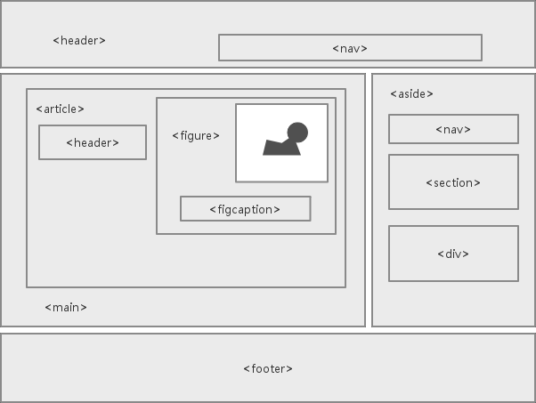

# 001 - HTML语义化

<motto></motto>

## HTML语义化是什么
htmL中自带了一些标签，这些标签有特定含义，比如H1-H6代表标题、p代表段落、img代表图片、html5里也推出了一些新的标签：
header、footer、nav这些标签都有特定的含义，使用的时候应该尽量按照它的语义来使用好处：

## 语义化的好处
1. 别人阅读你的代码的时候能够根据标签才出来你的用意，有利于程序员阅读，便于团队开发和维护
2. 浏览器读取方便，有利于搜索引擎优化（SE0：Search Engine Optimization）（比如说会根据标签来搜索，可能重点会搜索h1）
3. 有一些标签默认会有一些样式，如果浏览器禁止了CSS样式还可以达到突出样式的效果，比如h1

上图来自下面的文章

[HTML页面结构语义化](https://rainylog.com/post/ife-note-1/)