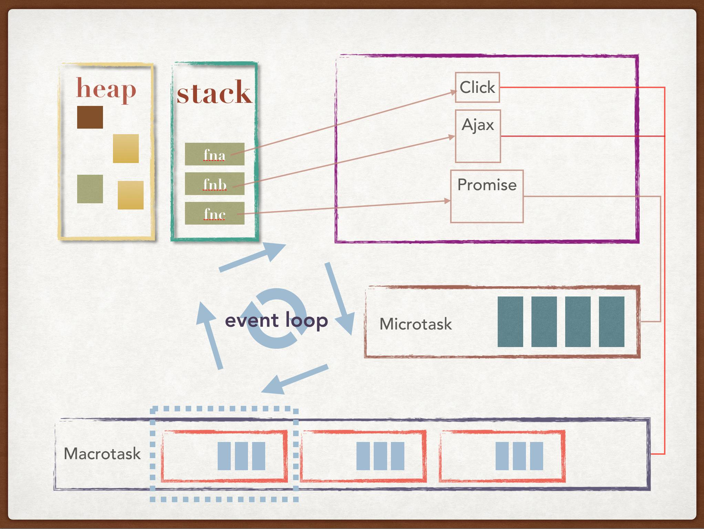
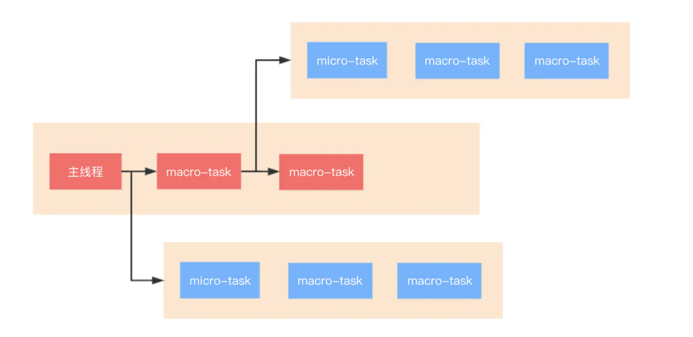
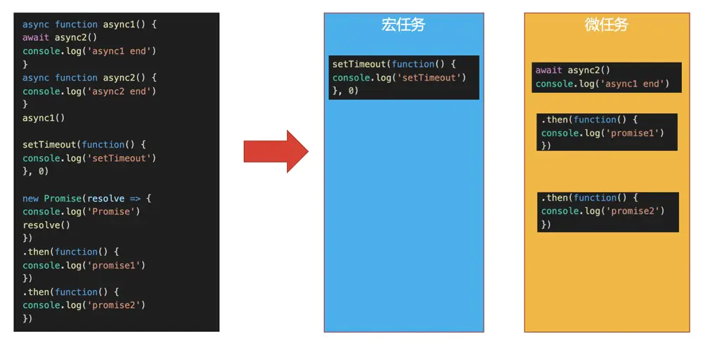
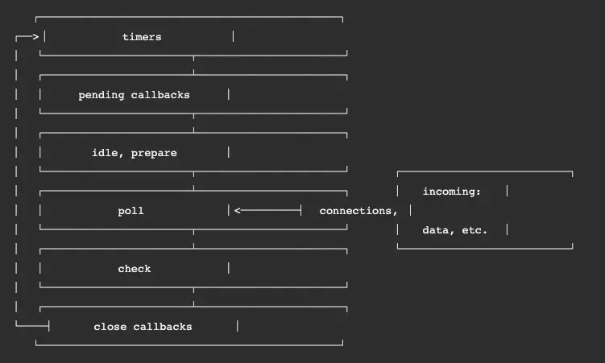

# 001: 说说事件循环机制(JS的执行机制)

<motto></motto>

> Event Loop 超棒演讲视频

<video style="width:40vw; " src="https://outin-2da6e967af7111ea960800163e1a65b6.oss-cn-shanghai.aliyuncs.com/sv/27b2aecf-172bac29ecc/27b2aecf-172bac29ecc.mp4?Expires=1592295614&OSSAccessKeyId=LTAIVVfYx6D0HeL2&Signature=P8qULn%2F%2BTfn%2FBMy1uVkAsb3qGfM%3D" controls="controls">
your browser does not support the video tag
</video>

## 思维导图

Event Loop 过程

一个完整的 Event Loop 过程，可以概括为以下阶段：

1. 初始状态：调用栈空。微任务(micro)队列空，宏任务(macro)队列里有且只有一个 script 脚本（整体代码）。

2. 第一步：全局上下文（script 标签）被推入调用栈，同步代码执行。在执行的过程中，通过对一些接口的调用，可以产生新的宏任务与微任务，它们会分别被推入各自的任务队列里。同步代码执行完了，script 脚本会被移出宏任务队列，这个过程本质上是队列的 macro-task 的执行和出队的过程。

3. 第二步：我们处理的是微任务。但需要注意的是：当宏任务出队时，任务是一个一个执行的；而微任务出队时，任务是一队一队执行的（如下图所示）。因此，处理微任务队列时，会逐个执行队列中的任务并把它出队，直到队列被清空。

4. 第三步：执行渲染操作，更新界面（敲黑板划重点）。注意：在执行渲染操作之前如果有RAF则会先调用RAF操作(requestAnimationFrame()函数)

5. 第四步：检查是否存在 Web worker 任务，如果有，则对其进行处理 。

（上述过程循环往复，直到两个队列都清空）

注意：在第二步中事件队列中分“宏任务队列”和“微任务队列”，每执行一次任务都可能注册新的宏任务或微任务到相应的任务队列中，只要遵循“每执行一个宏任务，就会清空一次事件队列中的所有微任务”这一循环规则，就不会弄乱。

## 1. 为什么 JavaScript 是单线程的？

因为 JS 是一门单线程的编程语言，也就是说同一时间只能做一件事。

1. 这是因为 JavaScript 生来作为浏览器脚本语言，主要用来处理与用户的交互、网络以及操作 DOM。这就决定了它只能是单线程的，否则会带来很复杂的同步问题。

   假设 JavaScript 有两个线程，一个线程在某个 DOM 节点上添加内容，另一个线程删除了这个节点，这时浏览器就不知道该以那个县城为准了。

2.
   为了简单，从一开始**JavaScript就是单线程**，单线程，事件循环机制已经成为JS的核心。

3. 为了利用多核CPU的计算能力，H5的Web Worker实现的“多线程”实际上指的是“多子线程”，完全受控于主线程，且不允许操作DOM；

## 2. 单线程架构的优势和劣势

### 优势：

* 单线程省去了线程间切换的开销
* 无需关注线程间的状态同步
* 无需关注死锁

### 劣势：

* 无法充分利用多核CPU
* 单线程架构，一旦主线程崩溃，整个进程就会崩溃，也就是整个应用就崩溃了。
* 大量计算占用CPU会导致应用阻塞(即不适用CPU密集型)

> **为了防止主线程的阻塞，JavaScript 有了 同步 和 异步 的概念。**

## 3. 同步、异步和阻塞、非阻塞

### 同步和异步（消息通信机制）

* 同步：同步方法调用一旦开始，调用者必须等到该函数调用返回后，才能继续后续的行为。
* 异步：如果在函数返回的时候，调用者还不能够得到预期结果，而是被调用者在将来通过状态、通知等手段告知调用者，那么这个函数就是异步的。典型的异步编程模型比如 Node.js

### 阻塞和非阻塞（等待结果时，线程的状态）

* 阻塞：在等待调用结果时，线程挂起了，不往下执行
* 非阻塞：与上面相反，当前线程继续往下执行

## 4. 执行栈（执行上下文）

栈 (stack): 栈是遵循后进先出 (LIFO) 原则的有序集合.

队列 (queue): 队列是遵循先进先出 (FIFO) 原则的有序集合。

堆 (heap): 堆是基于树抽象数据类型的一种特殊的数据结构。

JavaScript 中的内存分为 `堆内存` 和 `栈内存` ,

JavaScript 中引用类型值的大小是不固定的，因此它们会被存储到 堆内存 中，由系统自动分配存储空间。JavaScript 不允许直接访问堆内存中的位置，因此我们不能直接操作对象的堆内存空间，而是操作 对象的引用。

而 JavaScript 中的基础数据类型都有固定的大小，因此它们被存储到 栈内存 中。我们可以直接操作保存在栈内存空间的值，因此基础数据类型都是 按值访问。此外，栈内存还会存储 对象的引用 (指针) 以及 函数执行时的运行空间。

下面比较一下两种存储方式的不同。

| 栈内存                 | 堆内存                       |
| ---------------------- | ---------------------------- |
| 存储基础数据类型       | 存储引用数据类型             |
| 按值访问               | 按引用访问                   |
| 存储的值大小固定       | 存储的值大小不定，可动态调整 |
| 由系统自动分配内存空间 | 由程序员通过代码进行分配     |
| 主要用来执行程序       | 主要用来存放对象             |
| 空间小，运行效率高     | 空间大，但是运行效率相对较低 |
| 先进后出，后进先出     | 无序存储，可根据引用直接获取 |

## 5. JS单线程存在的问题(单线程是如何实现异步的)

众所周知，js是单线程的，JavaScript的执行机制就是**按照语句出现的顺序执行的**，也就是说js是一行一行执行的。

但是由于JS处理任务是一件接着一件处理的，所以，如果一个任务需要处理很久的话，后面的任务就会被阻塞。

那么怎么解决呢？

js通过Event Loop事件循环的方式解决了这个问题。



JavaScript的任务分为两种，在主线程上执行的任务"同步任务"，被主线程挂载起来的任务"异步任务", 后者一般是放在一个叫任务队列的数据结构中。

### (1)一些基本概念

#### 1. 任务队列

任务队列就是一个事件队列，其中最重要的是 `异步任务事件` 和 `定时事件` 。

* 异步任务事件：一般我们绑定一个事件，比如点击事件等等，都是在某一个时刻才触发执行的，这个时候就得放到任务队列里面，等待执行，而在某个DOM节点上绑定了事件，就要有相应的回调函数, 它们是相辅相成的。

  所谓回调函数，就是那些被挂载起来，等待执行的代码，主线程执行任务队列里面的异步任务，其实就是执行这些回调函数。

* 定时事件：setInterval 和 setTimeout

#### 2. 同步任务和异步任务

* 同步任务(synchronous)：在主线程上排队执行的任务，只有前一个任务执行完毕，才能执行后一个任务；
* 异步任务(asynchronous)：不进入主线程、而进入"任务队列"（task queue）的任务，只有"任务队列"通知主线程，某个异步任务可以执行了，该任务才会进入主线程执行。 (异步任务事件，定时事件，页面渲染请求图片获取异步资源等)

#### 3. 宏任务和微任务

不同类型的任务会进入不同的Event Queue，有宏任务队列和微任务队列。

这里需要注意的是new Promise是会进入到主线程中立刻执行，而promise.then则属于微任务。

### (2)浏览器中的事件循环

JavaScript代码的执行过程中，除了依靠**函数调用栈**来搞定函数的执行顺序外，还依靠**任务队列(task queue)**来搞定另外一些代码的执行。整个执行过程，我们称为 `事件循环过程` 。

一个线程中，事件循环是唯一的，但是任务队列可以拥有多个。任务队列又分为macro-task（宏任务）与micro-task（微任务），在最新标准中，它们被分别称为task与jobs。

宏任务macro-task大概包括：

* script(整体代码)
* setTimeout
* setInterval
* setImmediate（Nodejs）
* I/O
* UI render
* 事件
* postMessage
* MessageChannel

微任务micro-task大概包括:

* process.nextTick（Nodejs）
* Promise.then()
* Async/Await(实际就是promise)
* Object.observe
* MutationObserver(html5新特性)

整体执行，我画了一个流程图：



总的结论就是，

执行宏任务，然后执行该宏任务产生的微任务。

若微任务在执行过程中产生了新的微任务，则继续执行微任务。

**微任务全部执行完毕后，再回到宏任务中进行下一轮循环。**

举个栗子：



结合流程图理解，答案输出为：async2 end => Promise => async1 end => promise1 => promise2 => setTimeout 但是，对于async/await ，我们有个细节还要处理一下。如下：

### (3)当 Event Loop 遇到 async/await

我们知道 `async` 隐式返回 Promise 作为结果的函数, 那么可以简单理解为，await后面的函数执行完毕时，await会产生一个微任务(Promise.then是微任务)。

也就是说 `await 前面的代码` 是同步的，调用此函数时会直接执行；

而 `await func();` 这句可以被转换成 `Promise.resolve(func())` ； `await 后面的代码` 则会被放到 Promise 的 then() 方法里。

但是我们要注意这个微任务产生的时机，它是执行完await之后，直接跳出async函数，执行其他代码(此处就是线程的运作，A暂停执行，控制权交给B)。

**其他代码执行完毕后，再回到async函数去执行剩下的代码，然后把await后面的代码注册到微任务队列当中。**

我们来看个例子：

``` js
console.log('script start')

async function async1() {
    await async2()
    console.log('async1 end')
}
async function async2() {
    console.log('async2 end')
}
async1()

setTimeout(function() {
    console.log('setTimeout')
}, 0)

new Promise(resolve => {
        console.log('Promise')
        resolve()
    })
    .then(function() {
        console.log('promise1')
    })
    .then(function() {
        console.log('promise2')
    })

console.log('script end')
// 旧版Chrome输出如下，但是请继续看完本文下面的注意那里，新版有改动
// script start => async2 end => Promise => script end => promise1 => promise2 => async1 end => setTimeout
```

分析这段代码：

* 执行代码，输出 `script start` 。
* 执行async1(), 会调用async2(), 然后输出 `async2 end` , 此时将会保留async1函数的上下文，然后跳出async1函数。
* 遇到setTimeout，产生一个宏任务
* 执行Promise，输出 `Promise` 。遇到then，产生第一个微任务
* 继续执行代码，输出 `script end`
* 代码逻辑执行完毕(当前宏任务执行完毕)，开始执行当前宏任务产生的微任务队列，输出 `promise1` ，该微任务遇到then，产生一个新的微任务
* 执行产生的微任务，输出 `promise2` , 当前微任务队列执行完毕。执行权回到async1
* 执行await, 实际上会产生一个promise返回，即

``` js
let promise_ = new Promise((resolve, reject) {
    resolve(undefined)
})
```

执行完成，执行await后面的语句，输出 `async1 end`
* 最后，执行下一个宏任务，即执行setTimeout，输出 `setTimeout`

#### 注意

新版的chrome浏览器中不是如上打印的，因为chrome优化了, await变得更快了, 输出为:

``` js
// script start => async2 end => Promise => script end => async1 end => promise1 => promise2 => setTimeout
```

但是这种做法其实是违法了规范的，当然规范也是可以更改的，这是 V8 团队的一个 [PR](https://github.com/tc39/ecma262/pull/1250#issue-197979338) ，目前新版打印已经修改。 知乎上也有相关讨论, 可以看看 [www.zhihu.com/question/26…](https://www.zhihu.com/question/268007969)

我们可以分2种情况来理解：

1. 如果await 后面直接跟的为一个变量，比如：await 1；这种情况的话相当于直接把await后面的代码注册为一个微任务，可以简单理解为promise.then(await下面的代码)。然后跳出async1函数，执行其他代码，当遇到promise函数的时候，会注册promise.then()函数到微任务队列，注意此时微任务队列里面已经存在await后面的微任务。所以这种情况会先执行await后面的代码（async1 end），再执行async1函数后面注册的微任务代码(promise1,promise2)。
2. 如果await后面跟的是一个异步函数的调用，比如上面的代码，将代码改成这样：

``` js
console.log('script start')

async function async1() {
    await async2()
    console.log('async1 end')
}
async function async2() {
    console.log('async2 end')
    return Promise.resolve().then(() => {
        console.log('async2 end1')
    })
}
async1()

setTimeout(function() {
    console.log('setTimeout')
}, 0)

new Promise(resolve => {
        console.log('Promise')
        resolve()
    })
    .then(function() {
        console.log('promise1')
    })
    .then(function() {
        console.log('promise2')
    })

console.log('script end')
```

输出为：

``` js
// script start => async2 end => Promise => script end => async2 end1 => promise1 => promise2 => async1 end => setTimeout
```

此时执行完await并不先把await后面的代码注册到微任务队列中去，而是执行完await之后，直接跳出async1函数，执行其他代码。然后遇到promise的时候，把promise.then注册为微任务。其他代码执行完毕后，需要回到async1函数去执行剩下的代码，然后把await后面的代码注册到微任务队列当中，注意此时微任务队列中是有之前注册的微任务的。所以这种情况会先执行async1函数之外的微任务(promise1, promise2)，然后才执行async1内注册的微任务(async1 end). 可以理解为，这种情况下，await 后面的代码会在本轮循环的最后被执行. 浏览器中有事件循环，node 中也有，事件循环是 node 处理非阻塞 I/O 操作的机制，node中事件循环的实现是依靠的libuv引擎。由于 node 11 之后，事件循环的一些原理发生了变化，这里就以新的标准去讲，最后再列上变化点让大家了解前因后果。

### (4)node 中的事件循环

浏览器中有事件循环，node 中也有，事件循环是 node 处理非阻塞 I/O 操作的机制，node中事件循环的实现是依靠的libuv引擎。由于 node 11 之后，事件循环的一些原理发生了变化，这里就以新的标准去讲，最后再列上变化点让大家了解前因后果。

#### 宏任务和微任务

node 中也有宏任务和微任务，与浏览器中的事件循环类似，其中，

macro-task 大概包括：

* setTimeout
* setInterval
* setImmediate
* script（整体代码)
* I/O 操作等。

micro-task 大概包括：

* process.nextTick(与普通微任务有区别，在微任务队列执行之前执行)
* new Promise().then(回调)等。

#### node事件循环整体理解

先看一张官网的 node 事件循环简化图：



图中的每个框被称为事件循环机制的一个阶段，每个阶段都有一个 FIFO 队列来执行回调。虽然每个阶段都是特殊的，但通常情况下，当事件循环进入给定的阶段时，它将执行特定于该阶段的任何操作，然后执行该阶段队列中的回调，直到队列用尽或最大回调数已执行。当该队列已用尽或达到回调限制，事件循环将移动到下一阶段。

因此，从上面这个简化图中，我们可以分析出 node 的事件循环的阶段顺序为：

输入数据阶段(incoming data)->轮询阶段(poll)->检查阶段(check)->关闭事件回调阶段(close callback)->定时器检测阶段(timers)->I/O事件回调阶段(I/O callbacks)->闲置阶段(idle, prepare)->轮询阶段...

#### 阶段概述

* 定时器检测阶段(timers)：本阶段执行 timer 的回调，即 setTimeout、setInterval 里面的回调函数。
* I/O事件回调阶段(I/O callbacks)：执行延迟到下一个循环迭代的 I/O 回调，即上一轮循环中未被执行的一些I/O回调。
* 闲置阶段(idle, prepare)：此阶段"仅供内部使用"。
* 轮询阶段(poll)：检索新的 I/O 事件; 执行与 I/O 相关的回调（几乎所有情况下，除了关闭的回调函数，那些由计时器和 setImmediate() 调度的之外），其余情况 node 将在适当的时候在此阻塞。
* 检查阶段(check)：setImmediate() 回调函数在这里执行
* 关闭事件回调阶段(close callback)：一些关闭的回调函数，如：执行 socket 的 close 事件回调socket.on('close', ... )。

#### 整体流程

> node 的初始化

1. 初始化 node 环境。
2. 执行输入代码。
3. 执行 process.nextTick 回调。
4. 执行 microtasks。
5. 进入 event-loop

> 1.进入 timers 阶段

1. 检查 timer 队列是否有到期的 timer 回调，如果有，将到期的 timer 回调按照 timerId 升序执行。
2. 检查是否有 process.nextTick 任务，如果有，全部执行。
3. 检查是否有microtask，如果有，全部执行。
4. 退出该阶段。

> 2.进入IO callbacks阶段。

1. 检查是否有 pending 的 I/O 回调。如果有，执行回调。如果没有，退出该阶段。
2. 检查是否有 process.nextTick 任务，如果有，全部执行。
3. 检查是否有microtask，如果有，全部执行。
4. 退出该阶段。

> 3.进入 idle，prepare 阶段：

这两个阶段与我们编程关系不大，暂且按下不表。

> 4.进入 poll 阶段

首先检查是否存在尚未完成的回调，如果存在，那么分两种情况。

**第一种情况：**

1. 如果有可用回调（可用回调包含到期的定时器还有一些IO事件等），执行所有可用回调。
2. 检查是否有 process.nextTick 回调，如果有，全部执行。
3. 检查是否有 microtaks，如果有，全部执行。
4. 退出该阶段。

**第二种情况：**

如果没有可用回调。

1. 检查是否有 immediate 回调，如果有，退出 poll 阶段。如果没有，阻塞在此阶段，等待新的事件通知。
2. 如果不存在尚未完成的回调，退出poll阶段。


> 5.进入 check 阶段

1. 如果有immediate回调，则执行所有immediate回调。
2. 检查是否有 process.nextTick 回调，如果有，全部执行。
3. 检查是否有 microtaks，如果有，全部执行。
4. 退出 check 阶段

> 6.进入 closing 阶段。

1. 如果有immediate回调，则执行所有immediate回调。
2. 检查是否有 process.nextTick 回调，如果有，全部执行。
3. 检查是否有 microtaks，如果有，全部执行。
4. 退出 closing 阶段

检查是否有活跃的 handles（定时器、IO等事件句柄）

如果有，继续下一轮循环。
如果没有，结束事件循环，退出程序。

----

我们可以发现，在事件循环的每一个子阶段退出之前都会按顺序执行如下过程：

- 检查是否有 process.nextTick 回调，如果有，全部执行。
- 检查是否有 microtaks，如果有，全部执行。
- 退出当前阶段。

#### process.nextTick

process.nextTick 是一个独立于 eventLoop 的任务队列。

在每一个 eventLoop 阶段完成后会去检查 nextTick 队列，如果里面有任务，会让这部分任务优先于微任务执行。

看一个例子：

``` js
setImmediate(() => {
    console.log('timeout1')
    Promise.resolve().then(() => console.log('promise resolve'))
    process.nextTick(() => console.log('next tick1'))
});
setImmediate(() => {
    console.log('timeout2')
    process.nextTick(() => console.log('next tick2'))
});
setImmediate(() => console.log('timeout3'));
setImmediate(() => console.log('timeout4'));
```

* 在 node11 之前，因为每一个 eventLoop 阶段完成后会去检查 nextTick 队列，如果里面有任务，会让这部分任务优先于微任务执行，因此上述代码是先进入 check 阶段，执行所有 setImmediate，完成之后执行 nextTick 队列，最后执行微任务队列，因此输出为 `timeout1=>timeout2=>timeout3=>timeout4=>next tick1=>next tick2=>promise resolve`
* 在 node11 之后，process.nextTick 是微任务的一种, 因此上述代码是先进入 check 阶段，执行一个 setImmediate 宏任务，然后执行其微任务队列，再执行下一个宏任务及其微任务, 因此输出为 `timeout1=>next tick1=>promise resolve=>timeout2=>next tick2=>timeout3=>timeout4`

### node 版本差异说明

这里主要说明的是 node11 前后的差异，因为 node11 之后一些特性已经向浏览器看齐了。

总的变化一句话来说就是，

**如果是 node11 版本一旦执行一个阶段里的一个宏任务(setTimeout, setInterval和setImmediate)就立刻执行对应的微任务队列，而不是在微任务队列中注册完就先不管了**

#### timers 阶段的执行时机变化

``` js
setTimeout(() => {
    console.log('timer1')
    Promise.resolve().then(function() {
        console.log('promise1')
    })
}, 0)
setTimeout(() => {
    console.log('timer2')
    Promise.resolve().then(function() {
        console.log('promise2')
    })
}, 0)
```

* 如果是 node11 版本**一旦执行一个阶段里的一个宏任务(setTimeout, setInterval和setImmediate)就立刻执行微任务队列**，这就跟浏览器端运行一致，最后的结果为 `timer1=>promise1=>timer2=>promise2`
* 如果是 node10 及其之前版本要看第一个定时器执行完，第二个定时器是否在完成队列中.
  + 如果是第二个定时器还未在完成队列中，最后的结果为 `timer1=>promise1=>timer2=>promise2`
  + 如果是第二个定时器已经在完成队列中，则最后的结果为 `timer1=>timer2=>promise1=>promise2`

#### check 阶段的执行时机变化

``` js
setImmediate(() => console.log('immediate1'));
setImmediate(() => {
    console.log('immediate2')
    Promise.resolve().then(() => console.log('promise resolve'))
});
setImmediate(() => console.log('immediate3'));
setImmediate(() => console.log('immediate4'));
```

* 如果是 node11 后的版本，会输出 `immediate1=>immediate2=>promise resolve=>immediate3=>immediate4`
* 如果是 node11 前的版本，会输出 `immediate1=>immediate2=>immediate3=>immediate4=>promise resolve`

#### nextTick 队列的执行时机变化

``` js
setImmediate(() => console.log('timeout1'));
setImmediate(() => {
    console.log('timeout2')
    process.nextTick(() => console.log('next tick'))
});
setImmediate(() => console.log('timeout3'));
setImmediate(() => console.log('timeout4'));
```

* 如果是 node11 后的版本，会输出 `timeout1=>timeout2=>next tick=>timeout3=>timeout4`
* 如果是 node11 前的版本，会输出 `timeout1=>timeout2=>timeout3=>timeout4=>next tick`
以上几个例子，你应该就能清晰感受到它的变化了，反正记着一个结论，如果是 node11 版本一旦执行一个阶段里的一个宏任务(setTimeout, setInterval和setImmediate)就立刻执行对应的微任务队列。

### node 和 浏览器 eventLoop的主要区别

两者最主要的区别在于浏览器中的微任务是在每个相应的宏任务中执行的，而nodejs中的微任务是在不同阶段之间执行的。

> 本文部分来自
>
> https://juejin.im/post/5e5c7f6c518825491b11ce93
>
> https://juejin.im/post/5cbc0a9cf265da03b11f3505#heading-14
