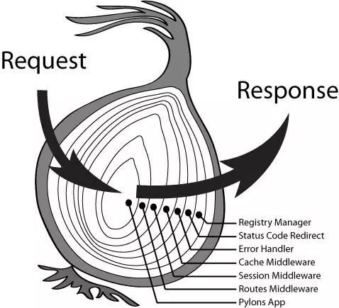

# 002-Koa源码解读：洋葱模型

 看看下面这两个图，如果你不太想看，或者是害怕看不懂，想想文章开头让你记住的话：

**整个过程实际就是在对*请求信息*进行信息获取及判断 和 对*回应信息*进行数据的逻辑及添加的处理**

请求Request的作用就是从request中获取一些信息并做一些判断，

响应Respond的作用就是根据在Request中获取的那些信息和判断结果在Respond里面添加一些数据，只不过这些数据需要根据从Request中获取的信息进行一定的加工处理。




在koa中，使用了koa-compose模块的compose 函数，从而实现了洋葱模型。

## 1.koa-compose

### (1)源码

``` js
'use strict'

/**
 * Expose compositor.暴露出组成器
 */

module.exports = compose

/**
 * Compose `middleware` returning
 * a fully valid middleware comprised
 * of all those which are passed.
 *
 * 组成“中间件”
 * 返回一个完全有效的中间件，
 * 该中间件由所有传递进来的中间件组成
 * （前面也说了中间件是在application.js里通过use方法push进middleware数组里的）
 *
 * @param {Array} middleware
 * @return {Function}
 * @api public
 */

function compose(middleware) {
    // 判断middleware是否为一个数组
    if (!Array.isArray(middleware)) throw new TypeError('Middleware stack must be an array!')
    // 判断middleware数组中的每一个中间件是否为一个函数
    for (const fn of middleware) {
        if (typeof fn !== 'function') throw new TypeError('Middleware must be composed of functions!')
    }

    /**
     * @param {Object} context
     * @return {Promise}
     * @api public
     */
    // 返回一个函数闭包, 保持对 middleware 的引用
    return function(context, next) {
        // 解释一下传入的 next
        // 这个传入的 next 函数是在所有中间件执行后的"最后"一个函数,
        // 这里的"最后"并不是真正的最后,而是像上面那个图中的圆心,
        // 执行完圆心之后, 会返回去执行上一个中间件函数(middleware[length - 1])剩下的逻辑

        // index 是用来记录中间件函数运行到了哪一个函数
        let index = -1
        // 执行第一个中间件函数
        return dispatch(0)

        // 声明dispatch函数
        function dispatch(i) {
            // i 是洋葱模型的记录该运行的函数中间件的下标,
            // 如果一个中间件里面运行两次 next, 那么 i 是会比 index 小的;

            // index存在的意义就是为了防止next()多次调用
            // 为什么能够防止呢？
            // 因为啊,我们可以看到下面有一行是 index = i
            // 第一次调用 next() 后,也就意味着  index 会等于 i,
            // 所以再次调用的话就会进入到 下面的 if 情况中
            if (i <= index) {
                return Promise.reject(new Error('next() called multiple times'))
            }
            index = i
            // 拿出middleware第i个中间件函数，赋值给fn
            let fn = middleware[i]
            // 判断如果i等于middleware的长度，就把next赋值给fn
            if (i === middleware.length) {
                // 这里的 next 就是一开始 compose 传入的 next,
                // 意味着当中间件函数数列执行完后, 执行这个 next 函数, 即圆心
                fn = next
            }
            // 如果没有函数, 直接返回状态为resolve且为空值的的Promise
			//没有函数也就意味着没有圆心函数，反正 koa 的源码中是没有传
            if (!fn) {
                return Promise.resolve()
            }
            try {
                // 为什么这里要包一层 Promise?
                // 因为 await 需要后面是 Promise,
                // 然后中间件中的 next 函数的返回值就是 dispatch 函数的返回值,
                // 所以运行 await next(); 需要 next 包一层 Promise
                // 所以next 函数是固定的, 可以执行下一个函数
                // 执行fn(context, dispatch.bind(null, i + 1))这个中间件函数，
                // 然后递归调用下一个中间件
                return Promise.resolve(fn(context, dispatch.bind(null, i + 1)));
            } catch (err) {
                return Promise.reject(err)
            }
        }
    }
}
```

compose函数接收middleware数组作为参数，middleware中每个对象都是一个async函数；

返回一个以context和next作为入参的函数，我们姑且和源码一样，称其为fnMiddleware；

### (2)compose里的next是什嘛

在这里，next是一个参数，这个参数是传入的回调函数，在洋葱模型执行到最里面的圆心时，会进行调用，即`if (i === middleware.length) {fn = next}`。如果未传入该参数，则不执行直接返回出`Promise.resolve()`。

我们会发现在源码中调用`compose所返回的函数即handleRequest中的fnMiddleware(ctx)`的时候，我们只是传入了ctx一个参数，并没有传入第二个next参数。

这是为什么呢？

我猜测，应该是因为虽然Koa的源码中并没有传入这个next参数,但是我们在正常的代码编写中如果有需要是可以进行传入的。

同时，在koa中所有的中间件的编写都是有 ctx 和 next 这两个参数，所以在这里使用 next 作为参数名也是为了统一整个 koa 框架的代码风格。


**栗子：**

```js
const Koa = require('koa')
const compose = require('koa-compose')
const path = require('path')

const app = new Koa()

let fn1 = async (ctx, next) => {
  console.log("1")
  await next()
  console.log("2")
}

let fn2 = async (ctx, next) => {
  console.log("3")
  await next()
  console.log("4")
}

let fn3 = async (ctx, next) => {
  console.log("5")
  await next()
  console.log("6")
}

const compose_middleware = compose([fn1, fn2, fn3])

compose_middleware(app.context, function(){
  console.log("我是compose函数内部的dispatch函数内部的next函数的log语句")
})
```

执行结果：

```js
> node app.js
1
3
5
我是compose函数内部的dispatch函数内部的next函数的log语句
6
4
2
```

我们再看一个栗子：

```js
const Koa = require('koa')
const compose = require('koa-compose')
const path = require('path')

const app = new Koa()

let fn1 = async (ctx, next) => {
  console.log("1")
  await next()
  console.log("2")
}

let fn2 = async (ctx, next) => {
  console.log("3")
  await next()
  console.log("4")
}

let fn3 = async (ctx, next) => {
  console.log("5")
  // await next()   //注意这里被注释掉了
  console.log("6")
}

const compose_middleware = compose([fn1, fn2, fn3])

compose_middleware(app.context, function() {
  console.log("我是compose函数内部的dispatch函数内部的next函数的log语句")
})
```

执行结果：

```js
> node app.js
1
3
5
6
4
2
```

可以很明显地看到我们传入的next函数并没有执行。

我们来看下具体的执行情况：

```js
// 第一阶段
{
    index: -1,
    i: 0,
    index: 0
}
// 执行了await next()
// 第二阶段
{
    i: 1,
    index: 1
}
// 执行了await next()
// 第三阶段
{
    i: 2,
    index: 2
}
// 执行了await next()
// 第四阶段
{
    i: 3,
    index: 3
    // 因为执行if (i === middleware.length) {fn = next}, 所以可以运行next函数
    // 但是在第二个例子中，因为注释掉了fn3 的 await next()，
    // 因此不会只会执行到第三阶段，所以i不会等于middleware.length, 因此不会运行next函数。
}
```

下面我们先将以下代码的运行顺一遍：

``` js
let fn1 = async (ctx, next) => {
    console.log("1")
    await next();
    console.log("2")
}
let fn2 = async (ctx, next) => {
    console.log("3")
    await next();
    console.log("4")
}
app.use(fn1)
app.use(fn2)
app.listen(3000)
```

**compose外层：**

1. 首先，因为调用了app实例的 `use()` 方法，所以在middleware数组中已经有了上面的两个函数了。
2. 在 `listen()` 方法中调用了 `callback()` 方法。(当执行完app.use时，服务还没启动，只有当执行到app.listen(3000)时，程序才真正启动。)
3. 然后又在 `callback()` 方法中调用了 `compose(middleware)` 方法并将**返回的函数**赋值给了fn。
4. 接着在 `callback()` 中又调用了 `handleRequest(ctx, fnMiddleware)` 方法，并将 **context**（使用了 `createContext()` 方法增强）和 上面compose方法返回的 **fn** 分别作为 **ctx** 和 **fnMiddleware** 这两个参数传入handleRequest方法。
5. 接着在handleRequest()方法中执行了 `fnMiddleware(ctx)` 。

6. `fnMiddleware(ctx)` 这个函数就是 `compose(middleware)` 的返回值。

**compose内层：**

接着上面的，开始进入koa-compose的compose函数进行执行，

compose函数接收middle对象作为参数，将middleware数组中的中间件组成一整个函数并返回这个函数。

1. `fnMiddleware(ctx)` 给compose返回的函数传入了context对象（虽然该函数有两个形参，但是没关系，第二个形参next在里面递归的时候会传入）
2. index初始化为-1。
3. 执行 `dispatch(0);` 。
4. 进入dispatch函数。
5. i 此时是0，index被赋值为0。
6. fn此时是第一个中间件，也就是一个async函数，将**返回一个Promise对象**。
7. 然后执行 `return Promise.resolve(fn(context, dispatch.bind(null, i + 1)));` （**Promise.resolve（）中若传入一个Promise对象的话，那么Promise.resolve将不做任何修改、原封不动地返回这个Promise对象**。）
   - 可以看到，向fn中传入了 `context` 和 `dispatch.bind(null, i + 1))` 这两个参数，实际上看到这里，脑袋转得快的同学一定就可以明白我们为什么要在中间件中使用 `next()` 了，就是因为next就是指 `dispatch.bind(null, i + 1))` ，而这个 `dispatch.bind(null, i + 1))` 里面是第二个中间件函数，再往下执行就又是一层dispatch()，这样层层套下去，就成了洋葱模型。（使用bind方法就是复制了一份函数，但是先不执行该函数，等我们在中间件中调用 `next()` 时才会调用）
8. 然后进入到第一个中间件代码内部： 先执行 `console.log("1")` 。
9. 然后执行 `await next();` ，并开始等待next函数执行完返回。
10. 进入到next函数，由于next()函数就是 `dispatch.bind(null, 0 + 1)` 也就是第二个中间件async函数，主要是执行dispatch(1)，于是老的dispatch（0）函数压入执行栈，开始从头开始执行dispatch(1)，即把第二个中间件函数赋值给fn，然后开始执行，**这步完成了程序控制权从第一个中间件到第二个中间件的转移**。
11. 执行dispatch(1)，i 此时就是1了，index被赋值为1。
12. 然后进入到第二个中间件代码内部： 先执行 `console.log("3")` ，然后执行 `await next();` 并开始等待next函数执行完返回；
13. 进入到next函数后，由于next()函数就是 `dispatch.bind(null, 1 + 1)` ，主要是执行dispatch(2)，于是老的dispatch(1)函数压栈，开始从头开始执行dispatch(2)
14. 然后dispatch(2)中执行 `let fn = middleware[i]` ，我们会发现，fn此时是`undefined`，因为已经没有中间件函数可以让我们使用啦。
15. 然后，因为 i 等于 middleware.length，所以`fn = next`，但是在Koa的源码中并没有传入next这个函数，所以next是undefined，所以此时fn依然被赋值为`undefined`。
16. 然后，下一步，因为fn是`undefined`，所以执行 `if (!fn) return Promise.resolve()`
17. 所以返回Promise.resolve()，此时第二个中间件的next函数返回了。
18. 接下来执行 `console.log("4")`
19. 由此第二个中间件执行完成，把程序控制权传递给第一个中间件。
20. 第一个中间件执行 `console.log("2")`

最终执行完所有中间件。输出为:

``` js
1
3
4
2
```

中间如果没有异常，则返回Promise.resolve()，执行fnMiddleware(ctx)后面的 `then(handleResponse)` 回调；若有异常，则返回Promise.reject(err), 执行 `catch(onerror)` 回调。

最终，你会发现 `compose` 就是类似这样的结构（移除一些判断）。

``` js
// 这样就可能更好理解了。
const [fn1, fn2, fn3] = this.middleware;
const fnMiddleware = function(context) {
    return Promise.resolve(
        fn1(context, function next() {
            return Promise.resolve(
                fn2(context, function next() {
                    return Promise.resolve(
                        fn3(context, function next() {
                            return Promise.resolve();
                        })
                    )
                })
            )
        })
    );
};
fnMiddleware(ctx).then(handleResponse).catch(onerror);
```


