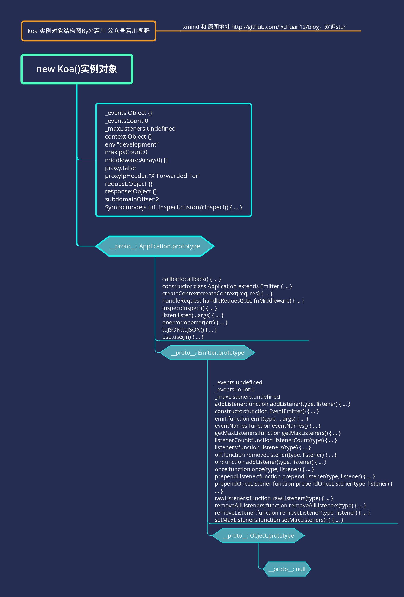
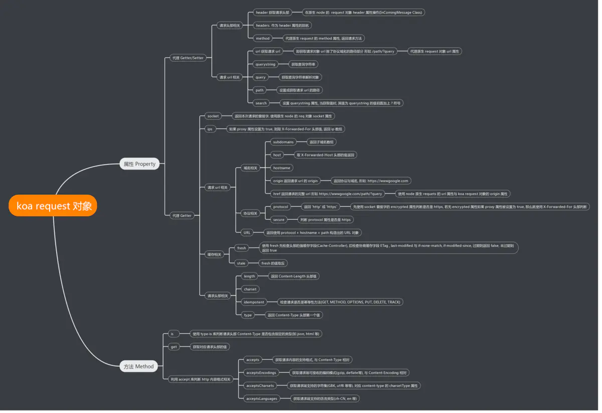
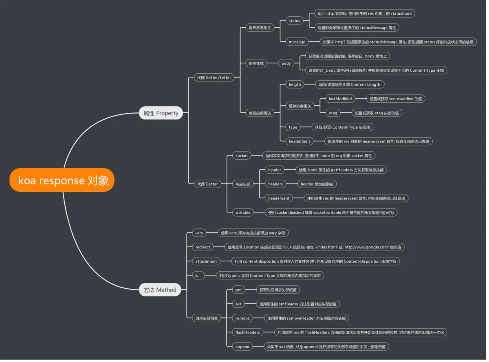
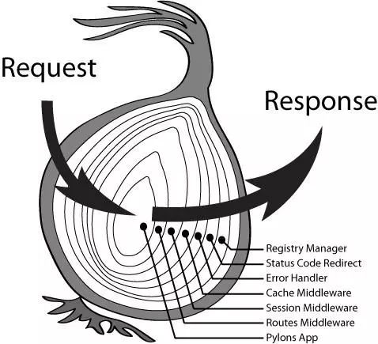

# 001-Koa源码解读

> 给你一个无删减版代码的Koa源码解读，几乎每一行以及导入的库都有解读喔。
>
> NOTE：本文的Koa源码版本为2.11.0

## 一、Koa源码

> 在看源码之前，先记住一句话：
>
> **整个过程实际就是在对*请求信息*进行信息获取及判断 和 对*回应信息*进行数据的逻辑及添加的处理**

context使用node原生的http监听回调函数中的req、res来进一步封装，意味着对于**每一个http请求**，koa**都会创建一个context**并**共享给所有的全局中间件使用**，当所有的中间件执行完后，会将所有的数据**统一交给res**进行**返回**。所以，在每个中间件中我们才能取得req的数据进行处理，最后ctx再把要返回的body给res进行返回。

**请记住句话：每一个请求都有唯一一个context对象，所有的关于请求和响应的东西都放在其里面。**

Koa的源码结构非常简单，就4个文件。

``` text
──lib
├── application.js // koa框架的入口文件
├── context.js // 创建网络请求的上下文对象
├── request.js // 用于包装koa的request对象
└── response.js // 用于包装koa的response对象
```

### 1.application.js

application.js是Koa的入口文件，它向外导出了创建class实例的构造函数。

Application类继承了Emitter，这也就意味着Koa框架拥有了**事件监听**和**事件触发**的能力。

Application类还暴露了一些常用的api，比如toJSON、listen、use等方法。

listen的实现原理，其实就是对http.createServer进行了一个封装，重点是这个函数中传入的callback，它里面包含了中间件的合并，上下文的处理，对res的特殊处理（当我们使用koa进行项目开发的时候，我们也可以根据需要自己对listen进行封装，常见的封装一般都在项目的bin文件夹的www文件里可引入http模块和设置端口号，用于启动koa2并且监听http的运行。）

use是将中间件加入‘洋葱’里，将多个中间件放入一个缓存队列中，然后通过koa-compose这个插件进行递归调用这里的中间件。

``` js
// 引入第三方库，个别库未进行列出
const isGeneratorFunction = require('is-generator-function'); // 判断这是否为迭代器函数
const debug = require('debug')('koa:application');
const onFinished = require('on-finished'); // 当HTTP请求关闭、完成或出现错误时执行回调。
const response = require('./response'); // Koa源码文件
// 实现基于async/await的洋葱式调用顺序的中间件容器的关键函数
const compose = require('koa-compose'); 
const context = require('./context'); // Koa源码文件
const request = require('./request'); // Koa源码文件
const statuses = require('statuses');
// Node的基础库，koa应用集成于它，主要用了其事件机制，来实现异常的处理
const Emitter = require('events'); 
const util = require('util');
const Stream = require('stream');
const http = require('http'); // node实现web服务器功能的核心库
const only = require('only'); // only函数用于返回所传入对象的白名单属性
// 为了支持koa1的generator中间件写法，对于使用generator函数实现的中间件函数，
// 需要通过koa-convert转换为类async函数
const convert = require('koa-convert'); 
const deprecate = require('depd')('koa');
const {
    HttpError
} = require('http-errors');

// 我们new一个Koa对象，实质上就是new一个Application的实例对象, 
// 而且由于Application类是继承于EventEmitter(Node.js events模块)的, 
// 所以我们在Koa实例对象上可以使用on, emit等方法进行事件监听
module.exports = class Application extends Emitter { 
    constructor(options) {
        super();
        options = options || {};
        // proxy是代理设置,proxy属性值是true或者false，
        // 它的作用在于是否获取真正的客户端ip地址。
        // 如果为 true，则解析 "Host" 的 header 域，并支持 X-Forwarded-Host
        this.proxy = options.proxy || false; 
        // 子域名偏移量设置，用于改变获取subdomain时返回数组的值。
        // 比如，test.blog.foo.com 域名, 如果设置 subdomainOffset 为 2, 
        // 那么返回的数组值为 ["blog", "test"], 如果设置为 3, 那么返回数组值为 ["test"]
        this.subdomainOffset = options.subdomainOffset || 2; 
        this.proxyIpHeader = options.proxyIpHeader || 'X-Forwarded-For';
        this.maxIpsCount = options.maxIpsCount || 0;
        // 保存Node的环境变量NODE_ENV值
        this.env = options.env || process.env.NODE_ENV || 'development'; 
        if (options.keys) this.keys = options.keys;
        this.middleware = []; // 该数组存放所有通过use函数引入的中间件函数
        // Object.create(parent)方法主要用于创建一个新对象，并将parent设置为新对象的原型
        // 创建context、request、response对象，
        // 新创建的对象分别拥有了context,request,response的原型方法
        this.context = Object.create(context); 
        this.request = Object.create(request);
        this.response = Object.create(response);
        if (util.inspect.custom) {
            this[util.inspect.custom] = this.inspect;
        }
    }

    // 创建服务器实例
    listen(...args) {
        debug('listen');
        // 通过执行callback函数返回的函数来作为处理每次请求的回调函数，callback函数是重点
        const server = http.createServer(this.callback());
        return server.listen(...args);
    }

    /**
     * Return JSON representation.
     * We only bother showing settings.
     *
     * @return {Object}
     * @api public
     */
    // 返回当前Application实例的json表现方式，
    // only(obj, keys)方法是only库中导出的一个方法(实际上就9行代码)，
    // 用于返回所传入对象的白名单属性。
    // 也就是说toJSON犯法只返回'subdomainOffset','proxy','env'这三个属性给外部呈现。
    // (如果你看了only的源码，你会发现还可以传入一个string，
    // 但是中间就需要使用空格将白名单属性隔开”subdomainOffset proxy env“)
    toJSON() {
        return only(this, [
            'subdomainOffset',
            'proxy',
            'env'
        ]);
    }

    /**
     * Inspect implementation.
     *
     * @return {Object}
     * @api public
     */
    inspect() { // 检查完成情况，返回结果上面的toJSON一样
        return this.toJSON();
    }

    /**
     * 通过调用koa应用实例的use函数，形如：
     * app.use(async (ctx, next) => {
     *     await next();
     * });
     * 来加入中间件
     */
    use(fn) {
        // 检查传入的参数是否为函数
        if (typeof fn !== 'function') {
            throw new TypeError('middleware must be a function!');
        }
        // 如果是generator函数，则需要通过koa-convert转换成类似类async/await函数
        //其核心原理是将 Generator 函数和自动执行器，包装在一个函数里。后文会重点解释
        if (isGeneratorFunction(fn)) {
            // Koa3将弃用generator函数，不再兼容generator式中间件的提醒
            deprecate('Support for generators will be removed in v3. ' +
                'See the documentation for examples of how to convert old middleware ' +
                'https://github.com/koajs/koa/blob/master/docs/migration.md');
            // 将generator函数转换为类async函数
            fn = convert(fn);
        }
        // 将该中间件加入middleware数组中
        this.middleware.push(fn);
        return this;
    }

    // 返回一个形如(req, res) => {}的函数，
    // 该函数会作为参数传递给上文listen函数中的http.createServer函数，
    // 作为处理请求的回调函数
    callback() {
        // 将所有中间件函数通过koa-compose组合一下，洋葱模型的实现，下面将详细讲解
        const fn = compose(this.middleware);
        // listenerCount函数是node的Emitter模块的方法，用于返回注册了指定事件的监听器数量
        // 如果没有error事件的监听器，就直接创建一个监听器，
        // 这个地方的onerror函数是application.js中Application类的方法
        if (!this.listenerCount('error')) this.on('error', this.onerror); 
        // handleRequest函数即处理请求用的，
        // 会作为参数传递给上文listen函数中的http.createServer函数，
        // 它就相当于http.creatServer的回调函数, 有 req, res 两个参数, 
        // 分别代表原生Node的request, response对象.
        const handleRequest = (req, res) => {
            // 基于req和res，对现有的context、request、response进行增强封装
            // 每次接受一个新的请求就是生成一次全新的context
            const ctx = this.createContext(req, res);
            // 当有请求到达时，需要根据则增强封装后
            // 拥有request和response信息的ctx和所有中间件函数
            // (此时所有的中间件已变成一个'洋葱'fn)，来处理该请求。
            // (注意，这个handleRequest方法指的是
            // 当前Application类的方法而并非当前所处的这个handleRequest函数表达式)
            return this.handleRequest(ctx, fn);
        };

        return handleRequest;
    }

    /**
     * Handle request in callback.
     *
     * @api private
     */
    handleRequest(ctx, fnMiddleware) {
        const res = ctx.res;
        res.statusCode = 404;
        // 错误处理: 调用的是context.js中的onerror，下面会分析它的源码
        const onerror = err => ctx.onerror(err); 
        const handleResponse = () => respond(ctx); // 处理响应内容 
        
        // on-finished这个包，主要就是 当HTTP请求关闭、完成或出现错误时执行回调。
        // onFinished(res, listener)函数是on-finished这个包导出的函数，
        // 其实就是给res挂载一个listener侦听器来侦听要完成的响应。
        // 当响应关闭、完成和报错时，listener侦听器将只被调用一次。
        // 如果对出现错误的响应结束，第一个参数将包含错误。如果响应已经完成，将调用listener侦听器。
        // 在侦听到响应结束时，将关闭与响应相关的内容，比如打开的文件将被强制关闭。
        // Listener被调用为 `Listener(err, res)` 
        
        // 这里是为res对象添加错误处理响应, 
        // 当res响应结束时, 执行onerror这个回调函数函数。
        // 注意:该处的onerror并非Application类的方法，而是context.js中的onerror
        onFinished(res, onerror); 
        // 下面是中间件执行、统一错误处理机制的关键
        // 执行fnMiddleware这个函数也就是执行在callback()方法中compose函数返回的函数，
        // 也就是执行中间件数组所有函数，实际就是在执行一层一层地执行那些中间件，
        // 最后若无任何异常则返回出来Promise.resolve()，
        // 执行fnMiddleware(ctx)后面的 `then(handleResponse)` 回调；
        // 若有异常，则返回Promise.reject(err), 执行 `catch(onerror)` 回调。
        return fnMiddleware(ctx).then(handleResponse).catch(onerror); 
        // 注意:该处的onerror并非Application类的方法，而是context.js中的onerror, 
        // context.js中的onerror的核心是在 this.app.emit('error', err, this); 
        // this.app就是对application的引用，当context.js的onerror触发时，
        // 会触发application实例的error事件。
        // 所以，我们可以在app.js中对koa实例app进行统一错误监听
        // app.on('error', err => {
        //	log.error('server error', err)
        // });
    }

    /**
     * Initialize a new context.
     *
     * @api private
     */
    // 基于req和res对象，增强封装context、request和response对象
    // 其实就是给context对象挂载了app对象，req对象(就是Node原生req)，
    // res对象(就是Node原生res)，originalUrl还有state对象的引用
    
    // 以及给request和response对象挂载了app对象，ctx对象(就是context)的引用，
    // 并在给request对象下挂载了response对象的引用，和在response对象下挂载了request对象的引用。
    
    // 不管在哪里出现，req就是Node原生的req，res就是Node原生的res; 
    // request就是Koa增强封装后的request，response就是Koa增强封装后的response
    
    // Object.create(parent)方法主要用于创建一个新对象，并将parent设置为新对象的原型
    createContext(req, res) {
        const context = Object.create(this.context);
        const request = context.request = Object.create(this.request);
        const response = context.response = Object.create(this.response);
        context.app = request.app = response.app = this;
        context.req = request.req = response.req = req;
        context.res = request.res = response.res = res;
        request.ctx = response.ctx = context;
        request.response = response;
        response.request = request;
        context.originalUrl = request.originalUrl = req.url;
        // 这里的state是专门负责保存单个请求状态的空对象，
        // 可以根据需要来管理内部内容。可以当做一个命名空间，
        // 可用于通过中间件传递信息,例如:ctx.state.user = await User.find(id);
        context.state = {}; 
        return context;
        // 为什么app、req、res、ctx也存放在了request、和response对象中呢？
        // 答：
        // 使它们同时共享一个app、req、res、ctx，是为了将处理职责进行转移，
        // 当用户访问时，只需要ctx就可以获取koa提供的所有数据和方法，
        // 而koa会继续将这些职责进行划分，比如request是进一步封装req的，
        // response是进一步封装res的，这样职责得到了分散，降低了耦合度，
        // 同时共享所有资源使context具有高内聚的性质，内部元素互相能访问到。
    }

    /**
     * Default error handler.
     *
     * @param {Error} err
     * @api private
     */
    onerror(err) { // 默认的错误处理
        // 先检查下传进来的参数是不是个Error，不是的话就报TypeError这个错
        if (!(err instanceof Error)) {
            throw new TypeError(util.format('non-error thrown: %j', err));
        }

        if (404 == err.status || err.expose) return;
        if (this.silent) return;

        const msg = err.stack || err.toString(); // 错误的堆栈详细信息
        console.error();
        console.error(msg.replace(/^/gm, '  '));
        console.error();
    }
};

/**
 * Response helper.
 */
// 该函数在Application类的handleRequest()中有使用，
// respond函数结合handleResponse函数表达式使用，在执行完所有中间件后，
// 如果在所有中间件中都没有error，则调用handleResponse函数即下面的respond()函数。

// 该函数主要是对即将返回的res，body和status进行处理，并且最终使用res.end(body)返回。
function respond(ctx) {
    // allow bypassing koa
    if (false === ctx.respond) return;

    if (!ctx.writable) return;

    const res = ctx.res;
    let body = ctx.body;
    const code = ctx.status;

    // ignore body
    if (statuses.empty[code]) {
        // strip headers
        ctx.body = null;
        return res.end();
    }

    if ('HEAD' === ctx.method) {
        if (!res.headersSent && !ctx.response.has('Content-Length')) {
            const {
                length
            } = ctx.response;
            if (Number.isInteger(length)) ctx.length = length;
        }
        return res.end();
    }

    // status body
    if (null == body) {
        if (ctx.req.httpVersionMajor >= 2) {
            body = String(code);
        } else {
            body = ctx.message || String(code);
        }
        if (!res.headersSent) {
            ctx.type = 'text';
            ctx.length = Buffer.byteLength(body);
        }
        return res.end(body);
    }

    // responses
    if (Buffer.isBuffer(body)) return res.end(body);
    if ('string' == typeof body) return res.end(body);
    if (body instanceof Stream) return body.pipe(res);

    // body: json
    body = JSON.stringify(body);
    if (!res.headersSent) {
        ctx.length = Buffer.byteLength(body);
    }
    res.end(body);
}

/**
 * Make HttpError available to consumers of the library so that consumers don't
 * have a direct dependency upon `http-errors` 
 */
// 让HttpError对Koa的使用者可用，这样使用者就不会直接依赖于“http-error”包
module.exports.HttpError = HttpError;
```

Koa(Application)实例对象结构图：



### 2.context.js

这部分就是koa的应用上下文ctx, context 的核心就是通过 delegates 这一个库, 将 request, response 对象上的属性方法代理到 context 对象上。这个代理就是为了开发者方便而设计的，比如**我们要访问ctx.response.status但是我们通过delegate，可以直接访问ctx.status访问到它**，相当于此时**ctx**就是**ctx.response**。

``` js
'use strict';

/**
 * Module dependencies.
 */
const util = require('util');
const createError = require('http-errors');
const httpAssert = require('http-assert');
const delegate = require('delegates');
const statuses = require('statuses');
const Cookies = require('cookies');

const COOKIES = Symbol('context#cookies');

/**
 * Context prototype.
 */
const proto = module.exports = {

    /**
     * util.inspect() implementation, which
     * just returns the JSON output.
     *
     * @return {Object}
     * @api public
     */
    // 很熟悉吧，和application.js里面的差不多一样
    inspect() {
        if (this === proto) return this;
        return this.toJSON();
    },

    /**
     * Return JSON representation.
     *
     * Here we explicitly invoke .toJSON() on each
     * object, as iteration will otherwise fail due
     * to the getters and cause utilities such as
     * clone() to fail.
     *
     * @return {Object}
     * @api public
     */
    // 这个toJSON主要是将我们的context使用JSON的形式来表示（原生的req，res还有socket都用字符串了。。。）
    // 下面不仅有调用上面application.js的toJSON()方法，还有调用request和response.js的toJSON()方法
    toJSON() {
        return {
            request: this.request.toJSON(),
            response: this.response.toJSON(),
            app: this.app.toJSON(),
            originalUrl: this.originalUrl,
            req: '<original node req>',
            res: '<original node res>',
            socket: '<original node socket>'
        };
    },

    /**
     * Similar to .throw(), adds assertion.
     *
     *    this.assert(this.user, 401, 'Please login!');
     *
     * See: https://github.com/jshttp/http-assert
     *
     * @param {Mixed} test
     * @param {Number} status
     * @param {String} message
     * @api public
     */

    assert: httpAssert,

    /**
     * Throw an error with `status` (default 500) and
     * `msg` . Note that these are user-level
     * errors, and the message may be exposed to the client.
     *
     *    this.throw(403)
     *    this.throw(400, 'name required')
     *    this.throw('something exploded')
     *    this.throw(new Error('invalid'))
     *    this.throw(400, new Error('invalid'))
     *
     * See: https://github.com/jshttp/http-errors
     *
     * Note: `status` should only be passed as the first parameter.
     *
     * @param {String|Number|Error} err, msg or status
     * @param {String|Number|Error} [err, msg or status]
     * @param {Object} [props]
     * @api public
     */

    throw (...args) { // 扔出Error
        throw createError(...args);
    },

    /**
     * Default error handling.
     *
     * @param {Error} err
     * @api private
     */
    // 默认的错误处理
    onerror(err) {
        // don't do anything if there is no error.
        // this allows you to pass `this.onerror` 
        // to node-style callbacks.
        // 没有错误就直接返回
        if (null == err) return;

        // 先检查下传进来的参数是不是个Error，不是的话就报TypeError这个错
        if (!(err instanceof Error)) err = new Error(util.format('non-error thrown: %j', err));

        let headerSent = false;
        if (this.headerSent || !this.writable) {
            headerSent = err.headerSent = true;
        }

        // delegate
        // emit就是Emitter的一个方法，因为Application类继承了Emitter，所以app这个实例可以使用emit方法
        // emit方法就是，发射event事件，传递若干可选参数到事件监听器的参数表
        
        // this.app就是对application的引用，
        // 当context.js的onerror触发时，会触发application实例的error事件
        this.app.emit('error', err, this); 

        // nothing we can do here other
        // than delegate to the app-level
        // handler and log.
        if (headerSent) {
            return;
        }

        const {
            res
        } = this;

        // first unset all headers
        /* istanbul ignore else */
        // 首先移除所有headers
        if (typeof res.getHeaderNames === 'function') {
            res.getHeaderNames().forEach(name => res.removeHeader(name));
        } else {
            res._headers = {}; // Node < 7.7
        }

        // then set those specified
        // 然后设置那些指定的error的headers
        this.set(err.headers);

        // force text/plain
        // 强制将类型改为text
        this.type = 'text';

        // ENOENT support
        if ('ENOENT' == err.code) err.status = 404;

        // default to 500
        // 默认将status改为500
        if ('number' != typeof err.status || !statuses[err.status]) err.status = 500;

        // respond
        // 响应
        const code = statuses[err.status];
        const msg = err.expose ? err.message : code;
        this.status = err.status;
        this.length = Buffer.byteLength(msg);
        res.end(msg); // 原生Node的响应结束
    },

    get cookies() {
        if (!this[COOKIES]) {
            this[COOKIES] = new Cookies(this.req, this.res, {
                keys: this.app.keys,
                secure: this.request.secure
            });
        }
        return this[COOKIES];
    },

    set cookies(_cookies) {
        this[COOKIES] = _cookies;
    }
};

/**
 * Custom inspection implementation for newer Node.js versions.
 *
 * @return {Object}
 * @api public
 */

/* istanbul ignore else */
if (util.inspect.custom) {
    module.exports[util.inspect.custom] = module.exports.inspect;
}

/**
 * Response delegation.
 */
// 我们在刚刚接触Koa，还不了解他的时候，
// 经常会被它的ctx里到底存了什么东西而困惑着，
// 因为常常我们认为会在ctx.request或者是ctx.response中出现的属性，
// 却可以使用ctx.headers或者ctx.url这样的直接进行调用

// 原因就在下面了，使用了代理。也就是ctx可以相当于ctx.request和ctx.response
delegate(proto, 'response')
    .method('attachment')
    .method('redirect')
    .method('remove')
    .method('vary')
    .method('has')
    .method('set')
    .method('append')
    .method('flushHeaders')
    .access('status')
    .access('message')
    .access('body')
    .access('length')
    .access('type')
    .access('lastModified')
    .access('etag')
    .getter('headerSent')
    .getter('writable');

/**
 * Request delegation.
 */

delegate(proto, 'request')
    .method('acceptsLanguages')
    .method('acceptsEncodings')
    .method('acceptsCharsets')
    .method('accepts')
    .method('get')
    .method('is')
    .access('querystring')
    .access('idempotent')
    .access('socket')
    .access('search')
    .access('method')
    .access('query')
    .access('path')
    .access('url')
    .access('accept')
    .getter('origin')
    .getter('href')
    .getter('subdomains')
    .getter('protocol')
    .getter('host')
    .getter('hostname')
    .getter('URL')
    .getter('header')
    .getter('headers')
    .getter('secure')
    .getter('stale')
    .getter('fresh')
    .getter('ips')
    .getter('ip');
```

#### delegates源码

**委托模式（Delegation Pattern）**，即外层暴露的对象将请求委托给内部的其他对象进行处理。

下面我们来看一下delegates的源码：

``` js
/**
 * Expose `Delegator` .
 */
module.exports = Delegator;

/**
 * Initialize a delegator.
 *
 * @param {Object} proto
 * @param {String} target
 * @api public
 */
// Delegator构造函数
function Delegator(proto, target) {
    // 如果 this 不是 Delegator 的实例的话，
    // 则调用 new Delegator(proto, target)。
    // 通过这种方式，可以避免在调用初始化函数时忘记写 new 造成的问题，
    // 因为此时下面两种写法是等价的: 
    // let d = new Delegator(proto, 'request')
    // let d = Delegator(proto, 'request')
    if (!(this instanceof Delegator)) return new Delegator(proto, target);
    this.proto = proto;
    this.target = target;
    this.methods = [];
    this.getters = [];
    this.setters = [];
    this.fluents = [];
    // this 对象中 methods | getters | setters | flaunts 均为数组，
    // 用于记录委托了哪些属性和函数。
}

/**
 * Delegate method `name` .
 *
 * @param {String} name
 * @return {Delegator} self
 * @api public
 */

Delegator.prototype.method = function(name) {
    var proto = this.proto;
    var target = this.target;
    this.methods.push(name);

    proto[name] = function() {
        return this[target][name].apply(this[target], arguments);
    };

    // 之所以在context.js里可以进行链式调用就是因为在这里把整个this给return了出来
    return this;
};

/**
 * Delegator accessor `name` .
 *
 * @param {String} name
 * @return {Delegator} self
 * @api public
 */

Delegator.prototype.access = function(name) {
    return this.getter(name).setter(name);
};

/**
 * Delegator getter `name` .
 *
 * @param {String} name
 * @return {Delegator} self
 * @api public
 */

Delegator.prototype.getter = function(name) {
    // this.proto 指向原型, 这里的 proto 就是上面的 proto, 也就是说 context 对象
    var proto = this.proto;
    // target 是传入的参数，实际指 'request'或'response' 字符串
    var target = this.target;
    // 将 name 加入到 delegator 实例对象的 getters 数组中
    this.getters.push(name);
    // 原生的obj.__defineGetter__(prop, func)，prop是一个字符串，
    // 表示指定的属性名；func是一个函数，当 prop 属性的值被读取时自动被调用。
    
    // 调用原生的 __defineGetter__ 方法进行 getter 代理, 
    // 那么 proto[name] 就相当于 proto[target][name]
    
    // 而 context.response 就相当于 response 对象
    // 由此实现属性代理
    // 需要注意的是尽管 __defineGetter__ 曾被广泛使用，
    // 但是如今已不被推荐，建议通过 Object.defineProperty 实现同样功能，
    // 或者通过 get 操作符实现类似功能:
    // Object.defineProperty(proto, 'url', {
    //    value: 'www.foo.com',
    // });
    // 
    // Object.defineProperty(proto, 'url', {
    //  get() {
    //    return 'www.bar.com';
    //  }
    // });
    proto.__defineGetter__(name, function() {
        return this[target][name];
    });

    // 之所以在context.js里可以进行链式调用就是因为在这里把整个this给return了出来
    return this;
};

/**
 * Delegator setter `name` .
 *
 * @param {String} name
 * @return {Delegator} self
 * @api public
 */

Delegator.prototype.setter = function(name) {
    // this.proto 指向原型, 这里的 proto 就是上面的 proto, 也就是说 context 对象
    var proto = this.proto;
    // target 是传入的参数，实际指 'request'或'response' 字符串
    var target = this.target;
    // 将 name 加入到 delegator 实例对象的 getters 数组中
    this.setters.push(name);
    // 原生的obj.__defineSetter__(prop, func)，prop是一个字符串，
    // 表示指定的属性名；func是一个函数，当试图给 prop 属性的值赋值时，将自动被调用。
    
    // 调用原生的 __defineSetter__ 方法进行 setter 代理, 
    // 那么 proto[name] 就相当于 proto[target][name]
    
    // 而 context.response 就相当于 response 对象
    // 由此实现属性代理
    // 需要注意的是尽管 __defineSetter__ 曾被广泛使用，但是如今已不被推荐，
    // 建议通过 Object.defineProperty 实现同样功能，或者通过 set 操作符实现类似功能:
    // Object.defineProperty(proto, 'url', {
    //  set(value) {
    //    this._url = value;
    //  }
    // });
    proto.__defineSetter__(name, function(val) {
        return this[target][name] = val;
    });

    // 之所以在context.js里可以进行链式调用就是因为在这里把整个this给return了出来
    return this;
};

/**
 * Delegator fluent accessor
 *
 * @param {String} name
 * @return {Delegator} self
 * @api public
 */
// 这个方法虽然没有用到但是还是可以说一下
// 除了上面的getter、setter这两种方式之外，还可以在外部对象上添加类似 jQuery 风格的函数，即：
// 函数不传参数的时候，获取对应的值
// 函数传参数的时候，修改对应的值
Delegator.prototype.fluent = function(name) {
    var proto = this.proto;
    var target = this.target;
    this.fluents.push(name);

    proto[name] = function(val) {
        if ('undefined' != typeof val) {
            this[target][name] = val;
            return this;
        } else {
            return this[target][name];
        }
    };

    return this;
};
```

### 3.request.js

这个就是对原生的req的一些操作了，主要使用ES6的get和set的一些语法，去取headers或者设置headers、还有设置body等等。(在看源码时不要疑惑， `get header() ` 和 `get headers() ` 确实是完全一样的，他们互为彼此的别名，也就是说都可以用，用起来也一样，就像是EventEmitter里的 `_addListener` 和 `on` 一样，好叭，这不是个很好的类比)

``` js
module.exports = {
        /**
         * Return request header.
         *
         * @return {Object}
         * @api public
         */

        get header() {
            return this.req.headers;
        },

        /**
         * Set request header.
         *
         * @api public
         */

        set header(val) {
            this.req.headers = val;
        },

        /**
         * Return request header, alias as request.header
         *
         * @return {Object}
         * @api public
         */

        get headers() {
            return this.req.headers;
        },

        /**
         * Set request header, alias as request.header
         *
         * @api public
         */

        set headers(val) {
            this.req.headers = val;
        },

        /**
         * Get request URL.
         *
         * @return {String}
         * @api public
         */

        get url() {
            return this.req.url;
        },

        /**
         * Set request URL.
         *
         * @api public
         */

        set url(val) {
            this.req.url = val;
        },
```

``` js
// 下面主要规整下request.js里面的方法
get header(); // 获得请求头对象
set header(val); // 设置请求头对象
get headers(); // 获得请求头对象
set headers(val); // 设置请求头对象
get url(); // 获得请求url地址
set url(val); // 设置请求url地址
get origin(); // 获得请求原始地址
get href(); // 获得完整的请求URL
get method(); // 获得请求方法
set method(val); // 设置请求方法
get path(); // 获得请求路径名
set path(path); // 设置请求路径名
get query(); // 获得查询参数字符串进行解析并以对象的形式返回，如果没有查询参数字字符串则返回一个空对象。 注意：该方法不支持嵌套解析。
set query(obj); // 设置根据给定的对象设置查询参数字符串。注意：该方法不支持嵌套对象。
get querystring(); // 获得查询参数字符串
set querystring(str); // 设置查询参数字符串
get search(); // 获得查询参数字符串
set search(str); // 设置查询参数字符串
get host(); // 获得host (hostname:port)。当 app.proxy 设置为 true 时，支持 X-Forwarded-Host。
get hostname(); // 获得hostname
get URL(); // 获取WHATWG解析的URL。惰性memoize的。
get fresh(); // 获得检查请求缓存是否 "fresh"(内容没有发生变化)。该方法用于在 If-None-Match / ETag, If-Modified-Since 和 Last-Modified 中进行缓存协调。当在 response headers 中设置一个或多个上述参数后，该方法应该被使用。
get stale(); // 检查请求是否过时，也就是“Last-Modified”或资源的“ETag”是否已经更改。
get idempotent(); // 获得请求是否为幂等(idempotent)
get socket(); // 获得请求的socket
get charset(); // 获取当前或未定义的字符集。
get length(); // 获得返回解析后的Content-length。
get protocol(); // 获得返回请求协议，"https" 或者 "http"。 当 app.proxy 设置为 true 时，支持 X-Forwarded-Host
get secure(); // 检查协议是否是‘https’
get ips(); // 获得当 X-Forwarded-For 存在并且 app.proxy 有效，将会返回一个有序（从 upstream 到 downstream）ip 数组。 否则返回一个空数组。
get ip(); // 获得请求IP地址。 当 app.proxy 设置为 true 时，支持 X-Forwarded-Host
set ip(_ip); // 设置请求IP地址
get subdomains(); // 获得以数组形式返回子域名。子域名是在host中逗号分隔的主域名前面的部分。默认情况下，应用的域名假设为host中最后两部分。其可通过设置 app.subdomainOffset 进行更改。举例来说，如果域名是"test.blog.foo.com":如果没有设置 app.subdomainOffset，其 subdomains 为 ["blog", "test"]。 如果设置 app.subdomainOffset 为3，其 subdomains 为 ["test"]。
get accept(); // 获得accept对象
set accept(obj); // 设置accept对象

accepts(...args); // 检查给定的类型 types(s) 是否可被接受，当为 true 时返回最佳匹配，否则返回 false。type 的值可以是一个或者多个 mime 类型字符串。 比如 "application/json" 扩展名为 "json"，或者数组 ["json", "html", "text/plain"]。
acceptsEncodings(...args); //检查 encodings 是否可以被接受，当为 true 时返回最佳匹配，否则返回 false。 注意：您应该在 encodings 中包含 identity。当没有传递参数时，返回包含所有可接受的 encodings 的数组;注意：如果客户端直接发送 identity;q=0 时，identity encoding（表示no encoding） 可以不被接受。虽然这是一个边界情况，您仍然应该处理这种情况。
acceptsCharsets(...args); //检查 charsets 是否可以被接受，如果为 true 则返回最佳匹配， 否则返回 false。当没有传递参数时，返回包含所有可接受的 charsets 的数组。
acceptsLanguages(...args); // 检查 langs 是否可以被接受，如果为 true 则返回最佳匹配，否则返回 false。当没有传递参数时，返回包含所有可接受的 langs 的数组。
is(type, ...types); // 检查请求所包含的 "Content-Type" 是否为给定的 type 值。 如果没有 request body，返回 undefined。 如果没有 content type，或者匹配失败，返回 false。 否则返回匹配的 content-type。

get type(); // 返回请求mime类型void；参数，如“charset”。
get(field); // 返回请求 header 中对应 field 的值
inspect(); // 在有请求时，也是返回JSON的表现形式；否则，返回空
toJSON(); // 返回JSON的表现形式
```



### 4.response.js

这个就是对原生的res的一些操作了，主要使用es6的get和set的一些语法，去取headers或者设置headers、还有设置body等等。(在看源码时不要疑惑， `get header() ` 和 `get headers() ` 确实是完全一样的，他们互为彼此的别名，也就是说都可以用，用起来也一样，就像是EventEmitter里的 `_addListener` 和 `on` 一样，好叭，这不是个很好的类比)

``` js
// 和上面的request内容的形式一样，不再一行行详细解释了
// 下面主要规整下response.js里面的方法
```




* 先看一下原生 Node.js 我开启一个 http 服务

``` js
const http = require('http');

http.createServer((req, res) => {
    res.writeHead(200);
    res.end('Hello World');
}).listen(3000);
```

* 看一下使用 koa2 开启一个http 服务

``` js
const Koa = require('koa');
const app = new Koa();
const {
    createReadStream
} = require('fs');

app.use(async (ctx, next) => {
    console.log("Hello World")
    await next();
});

app.use(ctx => {
    ctx.body = 'Hello Reno';
})
app.listen(3000);
```

当执行完app.use时，服务还没启动，只有当执行到app.listen(3000)时，程序才真正启动。

koa源码：

``` js
listen(...args) {
    const server = http.createServer(this.callback());
    return server.listen(...args);
}
```

这里使用了node原生http.createServer创建服务器，并把this.callback()作为参数传递进去。可以知道，this.callback()返回的一定是这种形式： `(req, res) => {}` 。继续看下this.callback代码。

## 二、洋葱模型

 看看下面这两个图，如果你不太想看，或者是害怕看不懂，想想文章开头让你记住的话：

**整个过程实际就是在对*请求信息*进行信息获取及判断 和 对*回应信息*进行数据的逻辑及添加的处理**

请求Request的作用就是从request中获取一些信息并做一些判断，

响应Respond的作用就是根据在Request中获取的那些信息和判断结果在Respond里面添加一些数据，只不过这些数据需要根据从Request中获取的信息进行一定的加工处理。




在koa中，使用了koa-compose模块的compose 函数，从而实现了洋葱模型。

### 1.koa-compose

#### (1)源码

``` js
'use strict'

/**
 * Expose compositor.暴露出组成器
 */

module.exports = compose

/**
 * Compose `middleware` returning
 * a fully valid middleware comprised
 * of all those which are passed.
 * 
 * 组成“中间件”
 * 返回一个完全有效的中间件，
 * 该中间件由所有传递进来的中间件组成
 * （前面也说了中间件是在application.js里通过use方法push进middleware数组里的）
 * 
 * @param {Array} middleware
 * @return {Function}
 * @api public
 */

function compose(middleware) {
    // 判断middleware是否为一个数组
    if (!Array.isArray(middleware)) throw new TypeError('Middleware stack must be an array!')
    // 判断middleware数组中的每一个中间件是否为一个函数
    for (const fn of middleware) {
        if (typeof fn !== 'function') throw new TypeError('Middleware must be composed of functions!')
    }

    /**
     * @param {Object} context
     * @return {Promise}
     * @api public
     */
    // 返回一个函数闭包, 保持对 middleware 的引用
    return function(context, next) {
        // 解释一下传入的 next
        // 这个传入的 next 函数是在所有中间件执行后的"最后"一个函数, 
        // 这里的"最后"并不是真正的最后,而是像上面那个图中的圆心, 
        // 执行完圆心之后, 会返回去执行上一个中间件函数(middleware[length - 1])剩下的逻辑

        // index 是用来记录中间件函数运行到了哪一个函数
        let index = -1
        // 执行第一个中间件函数
        return dispatch(0)

        // 声明dispatch函数
        function dispatch(i) {
            // i 是洋葱模型的记录已经运行的函数中间件的下标, 
            // 如果一个中间件里面运行两次 next, 那么 i 是会比 index 小的;
            
            // index存在的意义就是为了防止next()多次调用
            if (i <= index) {
                return Promise.reject(new Error('next() called multiple times'))
            }
            index = i
            // 拿出middleware第i个中间件函数，赋值给fn
            let fn = middleware[i] 
            // 判断如果i等于middleware的长度，就把next赋值给fn
            if (i === middleware.length) { 
                // 这里的 next 就是一开始 compose 传入的 next, 
                // 意味着当中间件函数数列执行完后, 执行这个 next 函数, 即圆心
                fn = next 
            }
            // 如果没有函数, 直接返回状态为resolve且为空值的的Promise
            if (!fn) {
                return Promise.resolve()
            }
            try {
                // 为什么这里要包一层 Promise? 
                // 因为 async 需要后面是 Promise, 
                // 然后中间件中的 next 函数的返回值就是 dispatch 函数的返回值, 
                // 所以运行 async next(); 需要 next 包一层 Promise
                // 所以next 函数是固定的, 可以执行下一个函数
                // 执行fn(context, dispatch.bind(null, i + 1))这个中间件函数，
                // 然后递归调用下一个中间件
                return Promise.resolve(fn(context, dispatch.bind(null, i + 1)));
            } catch (err) {
                return Promise.reject(err)
            }
        }
    }
}
```

compose函数接收middleware数组作为参数，middleware中每个对象都是一个async函数；

返回一个以context和next作为入参的函数，我们姑且和源码一样，称其为fnMiddleware；

#### (2)compose里的next是什嘛

在这里，next是一个参数，这个参数是传入的回调函数，在洋葱模型执行到最里面的圆心时，会进行调用，即`if (i === middleware.length) {fn = next}`。如果未传入该参数，则不执行直接返回出`Promise.resolve()`。

我们会发现在源码中调用`compose所返回的函数即handleRequest中的fnMiddleware(ctx)`的时候，我们只是传入了ctx一个参数，并没有传入第二个next参数。

这是为什么呢？

我猜测，应该是因为虽然Koa的源码中并没有传入这个next参数,但是我们在正常的代码编写中如果有需要是可以进行传入的。

**栗子：**

```js
const Koa = require('koa')
const compose = require('koa-compose')
const path = require('path')

const app = new Koa()

let fn1 = async (ctx, next) => {
  console.log("1")
  await next()
  console.log("2")
}

let fn2 = async (ctx, next) => {
  console.log("3")
  await next()
  console.log("4")
}

let fn3 = async (ctx, next) => {
  console.log("5")
  await next()
  console.log("6")
}

const compose_middleware = compose([fn1, fn2, fn3])

compose_middleware(app.context, function(){
  console.log("我是compose函数内部的dispatch函数内部的next函数的log语句")
})
```

执行结果：

```js
> node app.js
1
3
5
我是compose函数内部的dispatch函数内部的next函数的log语句
6
4
2
```

我们再看一个栗子：

```js
const Koa = require('koa')
const compose = require('koa-compose')
const path = require('path')

const app = new Koa()

let fn1 = async (ctx, next) => {
  console.log("1")
  await next()
  console.log("2")
}

let fn2 = async (ctx, next) => {
  console.log("3")
  await next()
  console.log("4")
}

let fn3 = async (ctx, next) => {
  console.log("5")
  // await next()   //注意这里被注释掉了
  console.log("6")
}

const compose_middleware = compose([fn1, fn2, fn3])

compose_middleware(app.context, function() {
  console.log("我是compose函数内部的dispatch函数内部的next函数的log语句")
})
```

执行结果：

```js
> node app.js
1
3
5
6
4
2
```

可以很明显地看到我们传入的next函数并没有执行。

我们来看下具体的执行情况：

```js
// 第一阶段
{
    index: -1,
    i: 0,
    index: 0    
}
// 执行了await next()
// 第二阶段
{
    i: 1,
    index: 1
}
// 执行了await next()
// 第三阶段
{
    i: 2,
    index: 2
}
// 执行了await next()
// 第四阶段
{
    i: 3,
    index: 3
    // 因为执行if (i === middleware.length) {fn = next}, 所以可以运行next函数
    // 但是在第二个例子中，因为注释掉了fn3 的 await next()，
    // 因此不会只会执行到第三阶段，所以i不会等于middleware.length, 因此不会运行next函数。
}
```

下面我们先将以下代码的运行顺一遍：

``` js
let fn1 = async (ctx, next) => {
    console.log("1")
    await next();
    console.log("2")
}
let fn2 = async (ctx, next) => {
    console.log("3")
    await next();
    console.log("4")
}
app.use(fn1)
app.use(fn2)
app.listen(3000)
```

**compose外层：**

01. 首先，因为调用了app实例的 `use()` 方法，所以在middleware数组中已经有了上面的两个函数了。
02. 在 `listen()` 方法中调用了 `callback()` 方法。(当执行完app.use时，服务还没启动，只有当执行到app.listen(3000)时，程序才真正启动。)
03. 然后又在 `callback()` 方法中调用了 `compose(middleware)` 方法并将**返回的函数**赋值给了fn。
04. 接着在 `callback()` 中又调用了 `handleRequest(ctx, fnMiddleware)` 方法，并将 **context**（使用了 `createContext()` 方法增强）和 上面compose方法返回的 **fn** 分别作为 **ctx** 和 **fnMiddleware** 这两个参数传入handleRequest方法。 
05. 接着在handleRequest()方法中执行了 `fnMiddleware(ctx)` 。

06. `fnMiddleware(ctx)` 这个函数就是 `compose(middleware)` 的返回值。

**compose内层：**

接着上面的，开始进入koa-compose的compose函数进行执行，

compose函数接收middle对象作为参数，将middleware数组中的中间件组成一整个函数并返回这个函数。

1. `fnMiddleware(ctx)` 给compose返回的函数传入了context对象（虽然该函数有两个形参，但是没关系，第二个形参next在里面递归的时候会传入）
2. index初始化为-1。
3. 执行 `dispatch(0);` 。
4. 进入dispatch函数。
5. i 此时是0，index被赋值为0。
6. fn此时是第一个中间件，也就是一个async函数，将**返回一个Promise对象**。
7. 然后执行 `return Promise.resolve(fn(context, dispatch.bind(null, i + 1)));` （**Promise.resolve（）中若传入一个Promise对象的话，那么Promise.resolve将不做任何修改、原封不动地返回这个Promise对象**。）
   - 可以看到，向fn中传入了 `context` 和 `dispatch.bind(null, i + 1))` 这两个参数，实际上看到这里，脑袋转得快的同学一定就可以明白我们为什么要在中间件中使用 `next()` 了，就是因为next就是指 `dispatch.bind(null, i + 1))` ，而这个 `dispatch.bind(null, i + 1))` 里面是第二个中间件函数，再往下执行就又是一层dispatch()，这样层层套下去，就成了洋葱模型。（使用bind方法就是复制了一份函数，但是先不执行该函数，等我们在中间件中调用 `next()` 时才会调用）
8. 然后进入到第一个中间件代码内部： 先执行 `console.log("1")` 。
9. 然后执行 `await next();` ，并开始等待next函数执行完返回。
10. 进入到next函数，由于next()函数就是 `dispatch.bind(null, 0 + 1)` 也就是第二个中间件async函数，主要是执行dispatch(1)，于是老的dispatch（0）函数压入执行栈，开始从头开始执行dispatch(1)，即把第二个中间件函数赋值给fn，然后开始执行，**这步完成了程序控制权从第一个中间件到第二个中间件的转移**。
11. 执行dispatch(1)，i 此时就是1了，index被赋值为1。
12. 然后进入到第二个中间件代码内部： 先执行 `console.log("3")` ，然后执行 `await next();` 并开始等待next函数执行完返回；
13. 进入到next函数后，由于next()函数就是 `dispatch.bind(null, 1 + 1)` ，主要是执行dispatch(2)，于是老的dispatch(1)函数压栈，开始从头开始执行dispatch(2)
14. 然后dispatch(2)中执行 `let fn = middleware[i]` ，我们会发现，fn此时是`undefined`，因为已经没有中间件函数可以让我们使用啦。
15. 然后，因为 i 等于 middleware.length，所以`fn = next`，但是在Koa的源码中并没有传入next这个函数，所以next是undefined，所以此时fn依然被赋值为`undefined`。
16. 然后，下一步，因为fn是`undefined`，所以执行 `if (!fn) return Promise.resolve()` 
17. 所以返回Promise.resolve()，此时第二个中间件的next函数返回了。
18. 接下来执行 `console.log("4")` 
19. 由此第二个中间件执行完成，把程序控制权传递给第一个中间件。 
20. 第一个中间件执行 `console.log("2")` 

最终执行完所有中间件。输出为:

``` js
1
3
4
2
```

中间如果没有异常，则返回Promise.resolve()，执行fnMiddleware(ctx)后面的 `then(handleResponse)` 回调；若有异常，则返回Promise.reject(err), 执行 `catch(onerror)` 回调。

最终，你会发现 `compose` 就是类似这样的结构（移除一些判断）。

``` js
// 这样就可能更好理解了。
const [fn1, fn2, fn3] = this.middleware;
const fnMiddleware = function(context) {
    return Promise.resolve(
        fn1(context, function next() {
            return Promise.resolve(
                fn2(context, function next() {
                    return Promise.resolve(
                        fn3(context, function next() {
                            return Promise.resolve();
                        })
                    )
                })
            )
        })
    );
};
fnMiddleware(ctx).then(handleResponse).catch(onerror);
```


## 三、错误处理

Koa提供了可以进行统一错误处理的办法。

如果要在Koa中统一处理错误的话，只需要让koa实例监听`'error'`事件就可以了。则所有的中间件逻辑错误都会在这里被捕获并处理。如下所示：

```js
app.on('error', err => {
    log.error('server error', err)
});
// -------------------------------------------------------------------------------
// 想好好处理一下的话，可以这样做
var server = http.createServer(app.callback())
server.listen(port)
server.on('error', onError)
function onError(error) {
    if (error.syscall !== 'listen') {
        throw error
    }

    var bind = typeof port === 'string' ?
        'Pipe ' + port :
        'Port ' + port

    // handle specific listen errors with friendly messages
    switch (error.code) {
        case 'EACCES':
            console.error(bind + ' requires elevated privileges')
            process.exit(1)
            break
        case 'EADDRINUSE':
            console.error(bind + ' is already in use')
            process.exit(1)
            break
        default:
            throw error
    }
}
```

相信在看完上面的application.js文件后，你会发现在三个地方有进行错误处理：

* 一个是在 `callback()` 中的 `if (!this.listenerCount("error")) this.on("error", this.onerror);` ，是在Application类里实现的方法 `onerror()` 。

* 另一个是 `onFinished(res, onerror);` 

  在context.js里实现的方法 `onerror()` ，并且在 `handleRequest()方法` 中进行了调用，由于使用了 `onFinished()函数` ，上文也有对该函数进行相应的解释，该函数主要是在HTTP响应结束时调用传入的回调函数，在这里使用的回调函数就是 `ctx.onerror()方法` 。

* 还有一个就是在 `return fnMiddleware(ctx).then(handleResponse).catch(onerror);` 。

  这个地方是统一错误处理的关键。

  在执行所有中间件的时候，若有异常，则Promise的状态会变成reject状态，所以会执行 `catch(onerror)` 回调，这里的 `onerror函数` 并非Application类的方法，而是context.js中的onerror，context.js中的onerror的核心是在 this.app.emit('error', err, this); this.app就是对application的引用，当context.js的onerror触发时，会触发application实例的error事件。

也就是说，Koa 继承了 **Emitter**，有了注册(发布)和监听(订阅)事件的能力后，***为了能够处理可能在任意时间抛出的异常***，所以需要**监听(订阅) error 事件**。

那根据上面我们看过的源码，可以知道在Koa中，error 的处理主要是针对的对象不同，有两个：

* 一个针对的是各个中间件内部发生错误的 error 处理，用来输出错误日志（在 `compose()函数` 和 `handleRequest()方法` 之间挂载，也就是在 `创建'洋葱模型函数'` 和 `执行'洋葱模型函数'` ）

* 一个是针对的是一次HTTP请求的错误处理，在 `handleRequest()方法` 中结合 `onFinished()函数` 后，可以监听一次HTTP的请求的 `关闭` 、 `完成` 或 `出现错误` 的事件，然后调用 `onerror()` 这个回调函数。

``` js
// application.js
// 在'创建洋葱模型函数'和'调用洋葱模型函数'之间，
// koa 会挂载一个默认的错误处理【运行时确定异常处理】
if (!this.listenerCount("error")) this.on("error", this.onerror); // callback()方法中的代码
// 在这行不知道该写点什么。。。就当做是分割线好啦
onerror(err) {
    if (!(err instanceofError))
        thrownewTypeError(util.format("non-error thrown: %j", err));

    // 如果没有在最外层指定错误事件侦听器
    // (也就是没有app.on('error',(err)=>{}))，
    // 那么将使用 app.onerror，除非 error.expose 为 true 
    // 或 app.silent 为 true 或 error.status 为 404，否则只简单记录错误。
    
    // 如果是状态码是404，则无需打印堆栈信息，直接返回即可
    if (404 == err.status || err.expose) return; 
    if (this.silent) return;

    const msg = err.stack || err.toString();
    console.error();
    console.error(msg.replace(/^/gm, "  "));
    console.error();
}

// -------------------------------------------------------------------------------

// context.js
// 默认的错误处理
// 默认的错误处理程序本质上是中间件链开始时的一个 try-catch。
// 创建你自己的错误处理程序的示例:
// app.use(async (ctx, next) => {
//   try {
//     await next();
//   } catch (err) {
//     // will only respond with JSON
//     ctx.status = err.statusCode || err.status || 500;
//     ctx.body = {
//       message: err.message
//     };
//   }
// })
// 要使用不同的错误处理程序，只需在中间件链的起始处放置另一个 try-catch，并在那里处理错误。
// 但是，默认错误处理程序对于大多数用例来说都是足够好的。
// 它将使用状态代码 err.status，或默认为500。如果 err.expose 是 true，
// 那么 err.message 就是答复。
// 否则，将使用从错误代码生成的消息（例如，对于代码500，将使用消息“内部服务器错误”）。

// 所有消息头将从请求中清除，但是任何在 err.headers 中的消息头将会被设置。
// 你可以使用如上所述的 try-catch 来向此列表添加消息头。
onerror(err) {
    // don't do anything if there is no error.
    // this allows you to pass `this.onerror` 
    // to node-style callbacks.
    // 没有错误就直接返回
    if (null == err) return;

    // 先检查下传进来的参数是不是个Error，不是的话就报TypeError这个错
    if (!(err instanceof Error)) err = new Error(util.format('non-error thrown: %j', err));

    let headerSent = false;
    if (this.headerSent || !this.writable) {
        headerSent = err.headerSent = true;
    }

    // delegate
    // emit就是Emitter的一个方法，因为Application类继承了Emitter，
    // 所以app这个实例可以使用emit方法
    
    // emit方法就是，发射event事件，传递若干可选参数到事件监听器的参数表
    
    // this.app就是对application的引用，
    // 当context.js的onerror触发时，会触发application实例的error事件
    this.app.emit('error', err, this); 

    // nothing we can do here other
    // than delegate to the app-level
    // handler and log.
    if (headerSent) {
        return;
    }

    const {
        res
    } = this;

    // first unset all headers
    /* istanbul ignore else */
    // 首先移除所有headers
    if (typeof res.getHeaderNames === 'function') {
        res.getHeaderNames().forEach(name => res.removeHeader(name));
    } else {
        res._headers = {}; // Node < 7.7
    }

    // then set those specified
    // 然后设置那些指定的error的headers
    this.set(err.headers);

    // force text/plain
    // 强制将类型改为text
    this.type = 'text';

    // ENOENT support
    if ('ENOENT' == err.code) err.status = 404;

    // default to 500
    // 默认将status改为500
    if ('number' != typeof err.status || !statuses[err.status]) err.status = 500;

    // respond
    // 响应
    const code = statuses[err.status];
    const msg = err.expose ? err.message : code;
    this.status = err.status;
    this.length = Buffer.byteLength(msg);
    res.end(msg); // 原生Node的响应结束
}
```

## THANK

[读 koa2 源码后的一些思考与实践](https://mp.weixin.qq.com/s?__biz=MzUxNzk1MjQ0Ng==&mid=2247484544&idx=1&sn=3180d250dfa5c76089d3b7bc2ddb1f5a&chksm=f9910251cee68b4773df8f8029682cad877add495c41130071f40fda520e014342c47536cc29&mpshare=1&scene=23&srcid=&sharer_sharetime=1580813890425&sharer_shareid=b12d04dea52958e10ae6bac1a582b72b#rd)

[学习 koa 源码的整体架构，浅析koa洋葱模型原理和co原理](https://www.lxchuan12.cn/koa/#前言)

