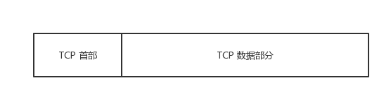

# 006-介绍一下 TCP 报文头部的字段

## 一、什么是报文？

例如一个 100kb 的 HTML 文档需要传送到另外一台计算机，并不会整个文档直接传送过去，可能会切割成几个部分，比如四个分别为 25kb 的数据段。
而每个数据段再加上一个 TCP 首部，就组成了 TCP 报文。

一共四个 TCP 报文，发送到另外一个端。

另外一端收到数据包，然后再剔除 TCP 首部，组装起来。

等到四个数据包都收到了，就能还原出来一个完整的 HTML 文档了。

> 在 OSI 的七层协议中，第二层（数据链路层）的数据叫「Frame」，第三层（网络层）上的数据叫「Packet」，第四层（传输层）的数据叫「Segment」。

TCP 报文 (Segment)，包括首部和数据部分。

而 TCP 的全部功能都体现在它首部中各字段的作用，只有弄清 TCP 首部各字段的作用才能掌握 TCP 的工作原理。
TCP 报文段首部的前20个字节是固定的，后面有 4N 字节是根据需要而增加的。
下图是把 TCP 报文中的首部放大来看。

TCP 的首部包括以下内容：

* 源端口 source port
* 目的端口 destination port
* 序号 sequence number
* 确认号 acknowledgment number
* 数据偏移 offset
* 保留 reserved
* 标志位 tcp flags
* 窗口大小 window size
* 检验和 checksum
* 紧急指针 urgent pointer
* 选项 tcp options

## 二、TCP 首部各字段的意义和作用

### 1. 源端口、目标端口

如何唯一标识一个连接？

答案是 **TCP 连接的四元组**——**源 IP、源端口**、**目标 IP 和目标端口**。

那 TCP 报文怎么没有源 IP 和目标 IP 呢？**这是因为在 IP 层就已经处理了 IP 。TCP 只需要记录两者的端口即可。**

源端口、目标端口各占 2 个 字节，共 4 个字节。

用来告知主机该报文段是来自哪里以及传送给哪个应用程序（应用程序绑定了端口）的。
进行 TCP 通讯时，客户端通常使用系统自动选择的临时端口号，而服务器则使用设置的服务端口号。

### 2. 序列号

即Sequence number, 指的是本报文段第一个字节的序列号。

从图中可以看出，序列号长为 4 个字节，根据 8 位 = 1 字节，那么 4 个字节也就是 32 位的无符号整数，表示范围为 0 ~ 2^32 - 1。序号增加到最大值的时候，下一个序号又回到了 0.

也就是说 TCP 协议可对 4GB 的数据进行编号，在一般情况下可保证当序号重复使用时，旧序号的数据早已经通过网络到达终点或者丢失了。

序列号在 TCP 通信的过程中有两个作用: 

1. 在 SYN 报文中交换彼此的初始序列号。
2. 保证数据包按正确的顺序组装。

### 3. ISN

即Initial Sequence Number（初始序列号）, 在三次握手的过程当中，双方会用过SYN报文来交换彼此的 ISN。

ISN 并不是一个固定的值，而是每 4 ms 加一，溢出则回到 0，这个算法使得猜测 ISN 变得很困难。那为什么要这么做？

如果 ISN 被攻击者预测到，要知道源 IP 和源端口号都是很容易伪造的，当攻击者猜测 ISN 之后，直接伪造一个 RST 后，就可以强制连接关闭的，这是非常危险的。

而动态增长的 ISN 大大提高了猜测 ISN 的难度。

> 补充阅读：
>
> 比如：假设C和S正在进行TCP通信，X是破坏者，可以预测TCP ISN。X可能的攻击包括：
>
> 一. 身份仿冒
>
> 攻击过程简述如下：
>
> 1）X首先对C进行攻击（比如Syn Flood），导致C不可用。
>
> 2）然后X仿冒C的地址对S发起连接请求。
>
> 3）S对C进行回应，附带ISN。注意：这个报文X是收不到的。
>
> 4）X可以预测ISN，可以按预测的ISN直接给S回应确认，这时S误认为已经和C建立了连接。
>
> 5）X这时就可以仿冒C的地址，发送恶意指令给S，S会认为这是C下发的指令，被欺骗执行，攻击生效。
>
> 

>
> 这个攻击过程中，X不需要获得S的任何报文，就可以对S下发数据，这些数据可能是恶意指令，从而达到攻击的目的。
>
> 二、DoS攻击
>
> 因为X可以预测C和S的序列号，就可以在C和S通信的过程中，假冒一方的IP地址，频繁抢先一步发送错误的报文：
>
> 1）发送序列号正确的ack报文，导致很多正确的报文被丢弃，TCP连接看上起正常，但是因为很多正确的报文被丢弃，实际处于拒绝服务状态。
>
> 2）发送序列号正确的fin报文，导致TCP连接关闭，系统处于拒绝服务状态。
>
> 三、信息投毒
>
> 和DoS攻击类似，但属于更高级别的攻击。因为X可以预测ISN，就可以在通信过程中，假冒其中一方，使用正确的序列号抢先发送非法内容，而正确的报文在到达时被认为是重复的无效报文被丢弃。
>
> 这种攻击需要对双方通信协议的内容有一定的了解，塞入的报文符合原来通信规格要求，被认为是合法报文进行了处理。

### 4. 确认号Acknowledgement Number

即ACK(Acknowledgment number)。占 4 个字节。表示期望收到对方下一个报文段的序号值，并且告诉对方**小于ACK**的所有字节已经全部收到。TCP 的可靠性，是建立在「每一个数据报文都需要确认收到」的基础之上的。

### 5. 数据偏移 Offset

占 0.5 个字节 (4 位)。

这个字段实际上是指出了 `TCP 报文段的首部长度` ，它指出了 TCP报文段的数据起始处 距离 TCP报文的起始处 有多远。（注意 数据起始处 和 报文起始处 的意思）

一个数据偏移量 = 4 byte，由于 4 位二进制数能表示的最大十进制数字是 15，因此数据偏移的最大值是 60 byte，这也侧面限制了 TCP 首部的最大长度。

### 6. 保留 Reserved

占 0.75 个字节 (6 位)。

保留为今后使用，但目前应置为 0。

### 7. 标记位 TCP Flags

标志位，一共有 6 个，分别占 1 位，共 6 位 。

每一位的值只有 0 和 1，分别表达不同意思。

标记位有URG, ACK, , PSH, RST, SYN, FIN。

| 控制位 | 作用                                                         |
| ------ | ------------------------------------------------------------ |
| URG    | 紧急指针，告诉接收TCP模块紧要指针域指着紧要数据              |
| ACK    | 置1时表示确认号合法，为0的时候表示数据段不包含确认信息，确认号被忽略 |
| PSH    | 置1时请求的数据段在接收方得到后就可直接送到应用程序，而不必等到缓冲区满时才传送 |
| RST    | 置1时重建连接。如果接收到RST位时候，通常发生了某些错         |
| SYN    | 置1时用来发起一个连接                                        |
| FIN    | 置1时表示发端完成发送任务。用来释放连接，表明发送方已经没有数据发送了 |

SYN 和 ACK 已经在上文说过，后三个解释如下: 

FIN： 即 Finish，表示发送方准备断开连接。

RST：即 Reset，用来强制断开连接。

PSH： 即 Push, 告知对方这些数据包收到后应该马上交给上层的应用，不能缓存。

#### 紧急 URG (Urgent)

当 URG = 1 的时候，表示紧急指针（Urgent Pointer）有效。

它告诉系统此报文段中有紧急数据，应尽快传送，而不要按原来的排队顺序来传送。

URG 要与首部中的 紧急指针 字段配合使用。

#### 确认 ACK (Acknowledgement)

当 ACK = 1 的时候，确认号（Acknowledgemt Number）有效。

一般称携带 ACK 标志的 TCP 报文段为「确认报文段」。

TCP 规定，在连接建立后所有传送的报文段都必须把 ACK 设置为 1。

#### 推送 PSH (Push)

当 PSH = 1 的时候，表示该报文段高优先级，接收方 TCP 应该尽快推送给接收应用程序，而不用等到整个 TCP 缓存都填满了后再交付。

#### 复位 RST (Reset)

当 RST = 1 的时候，表示 TCP 连接中出现严重错误，需要释放并重新建立连接。

一般称携带 RST 标志的 TCP 报文段为「复位报文段」。

#### 同步 SYN (SYNchronization)

当 SYN = 1 的时候，表明这是一个请求连接报文段。

一般称携带 SYN 标志的 TCP 报文段为「同步报文段」。

在 TCP 三次握手中的第一个报文就是同步报文段，在连接建立时用来同步序号。

对方若同意建立连接，则应在响应的报文段中使 SYN = 1 和 ACK = 1。

#### 终止 FIN (Finish)

当 FIN = 1 时，表示此报文段的发送方的数据已经发送完毕，并要求释放 TCP 连接。

一般称携带 FIN 的报文段为「结束报文段」。

在 TCP 四次挥手释放连接的时候，就会用到该标志。

### 8. 窗口大小Window Size

占 2 字节，也就是 16 位。

该字段明确指出了现在允许对方发送的数据量，它告诉对方本端的 TCP 接收缓冲区还能容纳多少字节的数据，这样对方就可以控制发送数据的速度。

窗口大小的值是指，从本报文段首部中的确认号算起，接收方目前允许对方发送的数据量。

例如，假如确认号是 701 ，窗口字段是 1000。这就表明，从 701 号算起，发送此报文段的一方还有接收 1000 （字节序号是 701 ~ 1700） 个字节的数据的接收缓存空间。

但实际上窗口大小是不够用的。

因此 TCP 引入了窗口缩放的选项，作为窗口缩放的比例因子，这个比例因子的范围在 0 ~ 14，比例因子可以将窗口的值扩大为原来的 2 ^ n 次方。

### 9. 校验和 TCP Checksum

占用两个字节，防止传输过程中数据包有损坏，如果遇到校验和有差错的报文，TCP 直接丢弃之，等待重传。

### 10. 紧急指针 Urgent Pointer

占 2 个字节。

仅在 URG = 1 时才有意义，它指出本报文段中的紧急数据的字节数。

当 URG = 1 时，发送方 TCP 就把紧急数据插入到本报文段数据的最前面，而在紧急数据后面的数据仍是普通数据。

因此，紧急指针指出了紧急数据的末尾在报文段中的位置。

### 11. 可选项

常用的可选项有以下几个:

\- TimeStamp: TCP 时间戳，后面详细介绍。 -

MSS: 指的是 TCP 允许的从对方接收的最大报文段。

\- SACK: 选择确认选项。

\- Window Scale： 窗口缩放选项。 

